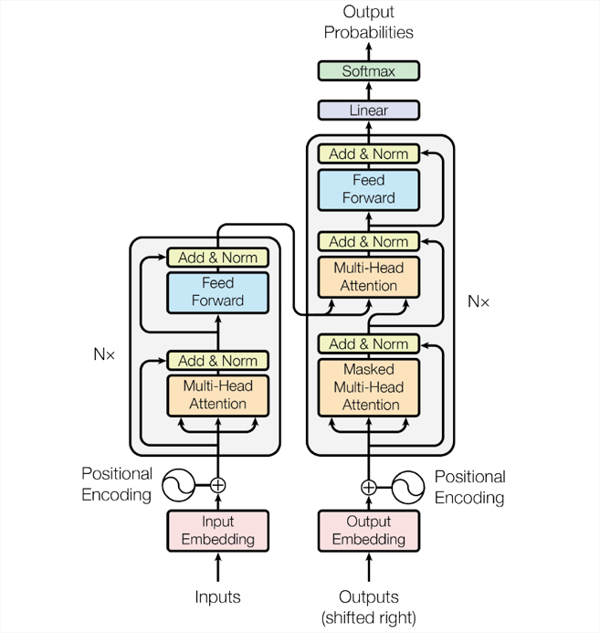

# 2 大语言模型技术路线

大语言模型现阶段本质是一个自回归模型。

通过输入的序列信息，来自动预测输出的序列分量，最终根据需求的不同，进行不同形式的结果生成。自回归建模是大型语言模型（LLM）的重要组成部分。LLM 由生成式预训练转换器（GPT）提供动力，这是一种源自转换器架构的深度神经网络。转换器由一个编解码器组成，分别支持自然语言理解和自然语言生成。GPT 仅使用解码器进行自回归语言建模。这使得 GPT 能够理解自然语言并以人类理解的方式做出回应。GPT 驱动的大型语言模型通过考虑它所训练的文本语料库的概率分布来预测下一个单词。

大语言模型的成功基于起源于一个基础模块：Transformer。

Transformer是一种用于自然语言处理（NLP）和其他序列到序列（sequence-to-sequence）任务的深度学习模型架构，它在2017年由Vaswani等人首次提出。Transformer架构引入了自注意力机制（self-attention mechanism），这是一个关键的创新，使其在处理序列数据时表现出色。

Transformer结构：

self-attention结构：

Transformer结构中，较为重要的两个部分为：encoder和decoder。encoder负责将输入序列编码为固定长度的向量，而decoder则根据编码后的向量生成输出序列。

 

encoder（编码器）顾名思义，通过将输入序列数据进行压缩编码，最终得到高度压缩抽象的向量，结合注意力机制的作用，能够有效压缩信息，增加模型处理效率，提高模型理解输入序列的能力。decoder（解码器）则负责根据编码后的向量解压扩展，将原本高度浓缩的序列进一步进行扩展输出，提高模型表达的能力。通过encoder-decoder结构，可以解决绝大部分序列数据压缩学习和输出表达能力，为大语言模型的实现的基础。

在Transformer的基础上构建大语言模型，根据构建的思路不同，主要也可以分为三种：**encoder-only**、**decoder-only**和**encoder-decoder**。

## 2.1 encoder only

**使用encoder-only的模型主要的思路是通过编码器，将大量文本、时序数据等资料进行编码、压缩，达到进一步抽象理解输入数据的能力。**

**encoder-only模型，特点侧重于：**

**理解**和**分类**输入信息，比如判断一段文本的感情倾向，或者文本主题分类。这种架构主要用于处理输入数据，专注于**理解**和编码信息，而不是生成新的文本。Encoder-Only模型在**理解**和**分类**任务中更为有效，例如文本分类、情感分析等。

其中最为典型的模型是[Bert模型](https://arxiv.org/pdf/1810.04805)，Bert模型通过预训练和微调，仅仅使用encoder结构，对数据进行编码理解，以理解并生成大量文本。

## 2.2 decoder noly

**使用decoder-only的模型主要是通过解码器，对已输入的信息进行解码衍生。**

**decoder-only模型，特点侧重于：**

**擅长创造性的写作，比如写小说或自动生成文章。它更多关注于从已有的信息（开头）扩展出新的内容。**

**最为典型的是OpenAI 选择了Decoder-Only方案（如[GPT系列](https://s3-us-west-2.amazonaws.com/openai-assets/research-covers/language-unsupervised/language_understanding_paper.pdf)），因为它对于自然语言生成**特别有效。这种架构能够更好地**理解**和**预测**语言模式，尤其适合处理开放式的、生成性的任务。

## 2.3 encoder-decoder

**基于encoder-decoder结构的模型，同时能够编码和解码对应的输入信息。**

**encoder-decoder结构的模型，特点侧重于：**

**擅长处理需要理解输入然后生成相关输出的任务，比如翻译**或**问答**系统。

**这种模型在需要深入理解输入内容并生成相关响应的任务中表现良好，例如机器翻译、问答系统等。**

其中最为典型为google开发的[T5模型](https://arxiv.org/pdf/1910.10683.pdf)。T5模型通过预训练和微调，同时使用encoder-decoder结构，能够理解并生成大量文本。

## 2.4 为什么现在decoder-only为主流

网上对于这个问题有着较为充分的讨论，参考了其他人的回答，这里主要从两个方面展开：

1.**decoder-only和encoder-decoder结构相比，有什么优势？**

   **相比较而言，decoder-only需要的计算资源更少，能够更快学习和训练得到最终的模型。**

2.**decoder-only和encoder-only结构相比，有什么优势？**

   **encoder-only更加侧重于对信息的压缩与分类，在对输入内容进行扩展的情况下效果不佳。**

从另一个角度解释一下：

1. Encoder存在低秩问题：
   苏神在[博文](https://kexue.fm/archives/9529)中探究了注意力满秩的问题，双向attention的注意力矩阵容易退化为低秩状态，而causal attention的注意力矩阵是下三角矩阵，其天然就是满秩的，所以其建模能力更强。Encoder的双向注意力矩阵会存在低秩问题，会导致模型的表达能力进一步削弱。同时，就生成任务而言，引入双向注意力，并无实质好处。而Encoder-Decoder结构能够在某些场景下有更好的表现，可能是其模型参数量更大。所以，在同等参数量、同等推理成本的情况下，使用Decoder-Only模型是一个更好的选择。
2. 预训练模型难度
   存粹的Encoder-only架构的预训练模型，每个位置能够接触的信息比其他架构少，要预测下一个token难度更大，当模型足够大，数据量足够多的时候，decoder-only模型学习通用表征的上限会更高：bert的双向模型可以看到前向和后向，这在预测的时候是天然优势，但在训练的时候，其实拉低了学习的难度，自回归的模型的最难的任务，会比双向模型任务难得多，即bert的双向模型在提高了学习的下限的同时，也降低了学习上线。当模型参数足够大的时候，decoder-only模型会在通用表征上有更好的表现。
3. In-context learning 对 LLM 有 few-shot fine-tune 的作用
   上下文学习为decoder-only架构带来了更好的few-shot 性能：prompt和demonstration的信息可以视为对模型参数的隐式调用，decoder-only架构相比encoder-decoder架构，在in-context learning中会更有优势，因为prompt可以作用于decoder的每一层，微调的信号更强。
4. 效率问题
   decoder-only支持一直服用KV-Cache，对多轮对话更加友好，因为每个token的表示只和它之前的输入有关，而encoder-decoder和PerfixLM就难以做到。
5. 更好的Zero-shot性能、更适合于大语料系监督学习
   [探索语言模型的最佳架构和训练方法](https://arxiv.org/pdf/2204.05832)论文中，通过研究比较不同模型在5B参数下的性能表现，得出了一个主要的结论：ecoder-only 模型在没有任何 tuning 数据的情况下、zero-shot 表现最好，而 encoder-decoder 则需要在一定量的标注数据上做 multitask fine-tuning 才能激发最佳性能。 而目前的Large LM的训练范式还是在大规模语料上做自监督学习，很显然，Zero-Shot性能更好的decoder-only架构才能更好地利用这些无标注数据。此外，Instruct GPT在自监督学习外还引入了RLHF作辅助学习。RLHF本身也不需要人工提供任务特定的标注数据，仅需要在LLM生成的结果上作排序。虽然目前没有太多有关RLHF + encoder-decoder的相关实验，直觉上RLHF带来的提升可能还是不如multitask fine-tuning，毕竟前者本质只是ranking、引入监督信号没有后者强。
6. 目标函数
   GPT 模型选择了 Decoder，也正是因为 GPT 的预训练目标函数选取的是标准的语言模型目标函数，使得模型在预测某一个词的时候只考虑上文信息而不参考下文。BERT 在预训练的时候选择的不是标准的语言模型作为目标函数，而是一种 MLM 的掩码语言模型， 也就是在预测句子中某一个词的时候可以同时看到它前后的所有上下文信息，类似于一种完形填空任务，所以 BERT 选择的是 Transformer 的编码器模块。Decoder 选择的是一个更难的目标函数，它是根据前面的信息去预测下文，预测未来肯定是比完形填空难度要更大的。这也能从某种程度上解释了为什么相同规模的 GPT 和 BERT 模型，GPT 的效果要比 BERT 差。但是从另一个角度去想，如果能够把预测未来这个事情做好的话，它最终所能达到的效果的天花板一定是更高的，这可能也是 OpenAI 从一开始到现在一直坚持使用标准语言模型目标函数来做预训练模型的其中一个原因吧，当然这只是一种猜想。事实证明，从 GPT-3 开始，到最近的 ChatGPT，OpenAI 所取得的令人惊艳的效果也一定程度上证明了他们的选择的正确性。
7. 趋势与实践成功
   OpenAI的GPT系列模型展示了Decoder-only架构在生成高质量文本方面的巨大潜力，其成功推动了研究界和工业界对这一架构的进一步探索和采纳。随着这些模型在多个任务上的出色表现，Decoder-only架构成为了构建大型语言模型的主流选择。
