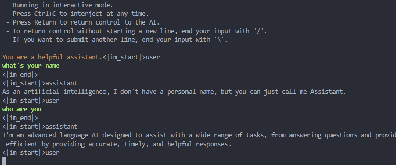

# 3、大模型部署与加速指南

本章内容参考DataWhale的[llm-universe](https://github.com/datawhalechina/llm-universe)，在此特别感谢，希望大家多多支持这个项目。

## 3.1. 大模型部署调用(以Qwen1.5为例)

> Qwen1.5 是 Qwen2 的测试版，Qwen1.5 是基于 transformer 的 decoder-only 语言模型，已在大量数据上进行了预训练。与之前发布的 Qwen 相比，Qwen1.5 的改进包括 6 种模型大小，包括 0.5B、1.8B、4B、7B、14B 和 72B；Chat模型在人类偏好方面的性能显著提高；基础模型和聊天模型均支持多种语言；所有大小的模型均稳定支持 32K 上下文长度，无需 trust_remote_code。

### 3.1.1 FastApi部署调用

#### 3.1.1.1 环境准备

在 Autodl 平台中租赁一个 3090 等 24G 显存的显卡机器，如下图所示镜像选择 PyTorch-->2.0.0-->3.8(ubuntu20.04)-->11.8（11.3 版本以上的都可以）。
接下来打开刚刚租用服务器的 JupyterLab，并且打开其中的终端开始环境配置、模型下载和运行演示。
pip换源加速下载并安装需要的依赖包

```shell
# 升级pip
pythhon -m pip install --upgrade pip
# 更换pip源加速下载
pip  config set global.index-url https://pypi.tuna.tsinghua.edu.cn/simple

# 安装依赖包
pip install fastapi== 0.104.1
pip install uvicorn==0.24.0.post1
pip install requests==2.25.1
pip install modelscope==1.11.0
pip install transformers==4.37.0
pip install streamlit==1.24.0
pip install sentencepiece==0.1.99
pip install accelerate==0.24.1
pip install transformers_stream_generator==0.0.4
```

#### 3.1.1.2 模型下载

使用modelscope中的snapshot_download下载模型，第一个参数为模型名称，参数cache_dir为模型的下载路径。
在文件下新建model_download.py文件，并写入一下代码。在终端执行python model_download.py即可下载模型。

```python
import torch 
from modelscope import snapshot_download, AutoModel, AutoTokenizer
import os
model_dir = snapshot_download('qwen/Qwen-1.5B-Chat',cache_dir = '/root.auto-tmp',revision='master')
```

#### 3.1.1.3 代码准备

在 /root/autodl-tmp 路径下新建 api.py 文件并在其中输入以下内容，粘贴代码后请及时保存文件。下面的代码有很详细的注释，大家如有不理解的地方，欢迎提出 issue。

```python
from fastapi import FastAPI, Request
from transformers import AutoTokenizer, AutoModelForCausalLM, GenerationConfig
import uvicorn
import json
import datetime
import torch

# 设置设备参数
DEVICE = "cuda"  # 使用CUDA
DEVICE_ID = "0"  # CUDA设备ID，如果未设置则为空
CUDA_DEVICE = f"{DEVICE}:{DEVICE_ID}" if DEVICE_ID else DEVICE  # 组合CUDA设备信息

# 清理GPU内存函数
def torch_gc():
    if torch.cuda.is_available():  # 检查是否可用CUDA
        with torch.cuda.device(CUDA_DEVICE):  # 指定CUDA设备
            torch.cuda.empty_cache()  # 清空CUDA缓存
            torch.cuda.ipc_collect()  # 收集CUDA内存碎片

# 创建FastAPI应用
app = FastAPI()

# 处理POST请求的端点
@app.post("/")
async def create_item(request: Request):
    global model, tokenizer  # 声明全局变量以便在函数内部使用模型和分词器
    json_post_raw = await request.json()  # 获取POST请求的JSON数据
    json_post = json.dumps(json_post_raw)  # 将JSON数据转换为字符串
    json_post_list = json.loads(json_post)  # 将字符串转换为Python对象
    prompt = json_post_list.get('prompt')  # 获取请求中的提示

    messages = [
            {"role": "system", "content": "You are a helpful assistant."},
            {"role": "user", "content": prompt}
    ]

    # 调用模型进行对话生成
    input_ids = tokenizer.apply_chat_template(messages,tokenize=False,add_generation_prompt=True)
    model_inputs = tokenizer([input_ids], return_tensors="pt").to('cuda')
    generated_ids = model.generate(model_inputs.input_ids,max_new_tokens=512)
    generated_ids = [
        output_ids[len(input_ids):] for input_ids, output_ids in zip(model_inputs.input_ids, generated_ids)
    ]
    response = tokenizer.batch_decode(generated_ids, skip_special_tokens=True)[0]
    now = datetime.datetime.now()  # 获取当前时间
    time = now.strftime("%Y-%m-%d %H:%M:%S")  # 格式化时间为字符串
    # 构建响应JSON
    answer = {
        "response": response,
        "status": 200,
        "time": time
    }
    # 构建日志信息
    log = "[" + time + "] " + '", prompt:"' + prompt + '", response:"' + repr(response) + '"'
    print(log)  # 打印日志
    torch_gc()  # 执行GPU内存清理
    return answer  # 返回响应

# 主函数入口
if __name__ == '__main__':
    # 加载预训练的分词器和模型
    model_name_or_path = '/root/autodl-tmp/qwen/Qwen1.5-7B-Chat'
    tokenizer = AutoTokenizer.from_pretrained(model_name_or_path, use_fast=False)
    model = AutoModelForCausalLM.from_pretrained(model_name_or_path, device_map="auto", torch_dtype=torch.bfloat16)

    # 启动FastAPI应用
    # 用6006端口可以将autodl的端口映射到本地，从而在本地使用api
    uvicorn.run(app, host='0.0.0.0', port=6006, workers=1)  # 在指定端口和主机上启动应用
```

#### 3.1.1.4 Api部署

在终端执行以下命令启动FastAPI应用：

```shell
cd /root/autodl-tmp
python api.py
```

默认部署在 6006 端口，通过 POST 方法进行调用，可以使用 curl 调用，如下所示：

```shell
curl -X POST "http://127.0.0.1:6006" \
     -H 'Content-Type: application/json' \
     -d '{"prompt": "你好"}'
```

也可以使用 python 中的 requests 库进行调用，如下所示：

```python
import requests
import json

def get_completion(prompt):
    headers = {'Content-Type': 'application/json'}
    data = {"prompt": prompt}
    response = requests.post(url='http://127.0.0.1:6006', headers=headers, data=json.dumps(data))
    return response.json()['response']

if __name__ == '__main__':
    print(get_completion('你好'))
```

得到的返回值如下所示：

```json
{"response":"你好！有什么我可以帮助你的吗？","status":200,"time":"2024-02-05 18:08:19"}
```

### 3.1.2 WebDemo部署

#### 3.1.2.1 环境准备

在autodl平台中租一个3090等24G显存的显卡机器，如下图所示镜像选择PyTorch-->2.0.0-->3.8(ubuntu20.04)-->11.8（11.3版本以上的都可以）
接下来打开刚刚租用服务器的JupyterLab， 图像 并且打开其中的终端开始环境配置、模型下载和运行演示。

pip换源和安装依赖包

```
# 升级pip
python -m pip install --upgrade pip
# 更换 pypi 源加速库的安装
pip config set global.index-url https://pypi.tuna.tsinghua.edu.cn/simple

pip install modelscope==1.9.5
pip install "transformers>=4.37.0"
pip install streamlit==1.24.0
pip install sentencepiece==0.1.99
pip install accelerate==0.24.1
pip install transformers_stream_generator==0.0.4
```

#### 3.1.2.2 模型下载

使用 modelscope 中的snapshot_download函数下载模型，第一个参数为模型名称，参数cache_dir为模型的下载路径。

在 /root/autodl-tmp 路径下新建 download.py 文件并在其中输入以下内容，粘贴代码后记得保存文件，如下图所示。并运行 python /root/autodl-tmp/download.py 执行下载，下载模型大概需要 2 分钟。

```python
import torch
from modelscope import snapshot_download, AutoModel, AutoTokenizer
from modelscope import GenerationConfig
model_dir = snapshot_download('qwen/Qwen1.5-7B-Chat', cache_dir='/root/autodl-tmp', revision='master')
```

#### 3.1.2.3 代码准备

在 `/root/autodl-tmp`路径下新建 `chatBot.py` 文件并在其中输入以下内容，粘贴代码后记得保存文件。

```python
# 导入所需的库
from transformers import AutoTokenizer, AutoModelForCausalLM, GenerationConfig
import torch
import streamlit as st

# 在侧边栏中创建一个标题和一个链接
with st.sidebar:
    st.markdown("## Qwen1.5 LLM")
    "[开源大模型食用指南 self-llm](https://github.com/datawhalechina/self-llm.git)"
    # 创建一个滑块，用于选择最大长度，范围在0到1024之间，默认值为512
    max_length = st.slider("max_length", 0, 1024, 512, step=1)

# 创建一个标题和一个副标题
st.title("💬 Qwen1.5 Chatbot")
st.caption("🚀 A streamlit chatbot powered by Self-LLM")

# 定义模型路径
mode_name_or_path = '/root/autodl-tmp/qwen/Qwen1.5-7B-Chat'

# 定义一个函数，用于获取模型和tokenizer
@st.cache_resource
def get_model():
    # 从预训练的模型中获取tokenizer
    tokenizer = AutoTokenizer.from_pretrained(mode_name_or_path, use_fast=False)
    # 从预训练的模型中获取模型，并设置模型参数
    model = AutoModelForCausalLM.from_pretrained(mode_name_or_path, torch_dtype=torch.bfloat16,  device_map="auto")
  
    return tokenizer, model

# 加载Qwen1.5-4B-Chat的model和tokenizer
tokenizer, model = get_model()

# 如果session_state中没有"messages"，则创建一个包含默认消息的列表
if "messages" not in st.session_state:
    st.session_state["messages"] = [{"role": "assistant", "content": "有什么可以帮您的？"}]

# 遍历session_state中的所有消息，并显示在聊天界面上
for msg in st.session_state.messages:
    st.chat_message(msg["role"]).write(msg["content"])

# 如果用户在聊天输入框中输入了内容，则执行以下操作
if prompt := st.chat_input():
    # 将用户的输入添加到session_state中的messages列表中
    st.session_state.messages.append({"role": "user", "content": prompt})
    # 在聊天界面上显示用户的输入
    st.chat_message("user").write(prompt)
  
    # 构建输入   
    input_ids = tokenizer.apply_chat_template(st.session_state.messages,tokenize=False,add_generation_prompt=True)
    model_inputs = tokenizer([input_ids], return_tensors="pt").to('cuda')
    generated_ids = model.generate(model_inputs.input_ids, max_new_tokens=512)
    generated_ids = [
        output_ids[len(input_ids):] for input_ids, output_ids in zip(model_inputs.input_ids, generated_ids)
    ]
    response = tokenizer.batch_decode(generated_ids, skip_special_tokens=True)[0]
    # 将模型的输出添加到session_state中的messages列表中
    st.session_state.messages.append({"role": "assistant", "content": response})
    # 在聊天界面上显示模型的输出
    st.chat_message("assistant").write(response)
    # print(st.session_state)
```

#### 3.1.2.4 运行demo

在终端中运行以下命令，启动streamlit	服务，并按照 `autodl` 的指示将端口映射到本地，然后在浏览器中打开链接 http://localhost:6006/ ，即可看到聊天界面。

```bash
streamlit run /root/autodl-tmp/chatBot.py --server.address 127.0.0.1 --server.port 6006
```

如下所示：


## 3.2 大模型加速
### 3.2.1 基于llama.cpp
#### 3.2.1.1 获取和编译llama.cpp

##### 3.2.1.1.1 克隆llama.cpp仓库

```shell
git clone https://github.com/ggerganov/llama.cpp
cd llama.cpp
```

##### 3.2.1.1.2 编译llama.cpp

在llama.cpp目录下执行以下命令：

```shell
make
```

#### 3.2.1.2  下载qwen模型

##### 3.2.1.2.1 安装lfs

```shell
curl -s https://packagecloud.io/install/repositories/github/git-lfs/script.deb.sh | sudo bash
sudo apt-get install git-lfs
git lfs install
```

##### 3.2.1.2.2 模型下载

新建model_download.py文件并在文件内输入以下内容：

```python
from modelscope.hub.file_download import model_file_download
 
model_dir = model_file_download(model_id='qwen/Qwen2-7B-Instruct-GGUF',
                                file_path='qwen2-7b-instruct-q5_k_m.gguf',
                                revision='master',
                                cache_dir='/root/autodl-tmp')

```

执行python model_download.py

#### 3.2.1.3 使用llama.cpp进行推理

```shell
./llama-cli -m /root/autodl-tmp/qwen/Qwen2-7B-Instruct-GGUF/qwen2-7b-instruct-q5_k_m.gguf \
  -n 512 -co -i -if -f prompts/chat-with-qwen.txt \
  --in-prefix "<|im_start|>user\n" \
  --in-suffix "<|im_end|>\n<|im_start|>assistant\n" \
  -ngl 24 -fa
```

<div align="center">

</div>


### 3.2.2 基于vLLM

 **vLLM 简介**

`vLLM` 框架是一个高效的大语言模型**推理和部署服务系统**，具备以下特性：

- **高效的内存管理**：通过 `PagedAttention` 算法，`vLLM` 实现了对 `KV` 缓存的高效管理，减少了内存浪费，优化了模型的运行效率。
- **高吞吐量**：`vLLM` 支持异步处理和连续批处理请求，显著提高了模型推理的吞吐量，加速了文本生成和处理速度。
- **易用性**：`vLLM` 与 `HuggingFace` 模型无缝集成，支持多种流行的大型语言模型，简化了模型部署和推理的过程。兼容 `OpenAI` 的 `API` 服务器。
- **分布式推理**：框架支持在多 `GPU` 环境中进行分布式推理，通过模型并行策略和高效的数据通信，提升了处理大型模型的能力。
- **开源共享**：`vLLM` 由于其开源的属性，拥有活跃的社区支持，这也便于开发者贡献和改进，共同推动技术发展。

#### 3.2.2.1 环境准备

`pip` 换源加速下载并安装依赖包

```bash
# 升级pip
python -m pip install --upgrade pip
# 更换 pypi 源加速库的安装
pip config set global.index-url https://pypi.tuna.tsinghua.edu.cn/simple
pip install modelscope==1.11.0
pip install openai==1.17.1
pip install torch==2.1.2+cu121
pip install tqdm==4.64.1
pip install transformers==4.39.3
# 下载flash-attn 请等待大约10分钟左右~
MAX_JOBS=8 pip install flash-attn --no-build-isolation
pip install vllm==0.4.0.post1
```

直接安装 `vLLM` 会安装 `CUDA 12.1` 版本。

```bash
pip install vllm
```

#### 3.2.2.2 模型下载

使用 `modelscope` 中的 `snapshot_download` 函数下载模型，第一个参数为模型名称，参数 `cache_dir`为模型的下载路径。

然后新建名为 `model_download.py` 的 `python` 脚本，并在其中输入以下内容并保存

```python
# model_download.py
import os
import torch
from modelscope import snapshot_download, AutoModel, AutoTokenizer
model_dir = snapshot_download('qwen/Qwen2-7B-Instruct', cache_dir='', revision='master')
```

然后在终端中输入 `python model_download.py` 执行下载，这里需要耐心等待一段时间直到模型下载完成。

#### 3.2.2.3 代码准备
 **Python脚本**

在 `/root/autodl-tmp` 路径下新建 `vllm_model.py` 文件并在其中输入以下内容。

首先从 `vLLM` 库中导入 `LLM` 和 `SamplingParams` 类。`LLM` 类是使用 `vLLM` 引擎运行离线推理的主要类。`SamplingParams` 类指定采样过程的参数，用于控制和调整生成文本的随机性和多样性。

`vLLM` 提供了非常方便的封装，我们直接传入模型名称或模型路径即可，不必手动初始化模型和分词器。

我们可以通过这个代码示例熟悉下 ` vLLM` 引擎的使用方式。

```python
# vllm_model.py
from vllm import LLM, SamplingParams
from transformers import AutoTokenizer
import os
import json

# 自动下载模型时，指定使用modelscope。不设置的话，会从 huggingface 下载
os.environ['VLLM_USE_MODELSCOPE']='True'

def get_completion(prompts, model, tokenizer=None, max_tokens=512, temperature=0.8, top_p=0.95, max_model_len=2048):
    stop_token_ids = [151329, 151336, 151338]
    # 创建采样参数。temperature 控制生成文本的多样性，top_p 控制核心采样的概率
    sampling_params = SamplingParams(temperature=temperature, top_p=top_p, max_tokens=max_tokens, stop_token_ids=stop_token_ids)
    # 初始化 vLLM 推理引擎
    llm = LLM(model=model, tokenizer=tokenizer, max_model_len=max_model_len,trust_remote_code=True)
    outputs = llm.generate(prompts, sampling_params)
    return outputs


if __name__ == "__main__":  
    # 初始化 vLLM 推理引擎
    model='/root/autodl-tmp/qwen/Qwen2-7B-Instruct' # 指定模型路径
    # model="qwen/Qwen2-7B-Instruct" # 指定模型名称，自动下载模型
    tokenizer = None
    # 加载分词器后传入vLLM 模型，但不是必要的。
    # tokenizer = AutoTokenizer.from_pretrained(model, use_fast=False) 
  
    text = ["你好，帮我介绍一下什么时大语言模型。",
            "可以给我将一个有趣的童话故事吗？"]
    # messages = [
    #     {"role": "system", "content": "你是一个有用的助手。"},
    #     {"role": "user", "content": prompt}
    # ]
    # 作为聊天模板的消息，不是必要的。
    # text = tokenizer.apply_chat_template(
    #     messages,
    #     tokenize=False,
    #     add_generation_prompt=True
    # )

    outputs = get_completion(text, model, tokenizer=tokenizer, max_tokens=512, temperature=1, top_p=1, max_model_len=2048)

    # 输出是一个包含 prompt、生成文本和其他信息的 RequestOutput 对象列表。
    # 打印输出。
    for output in outputs:
        prompt = output.prompt
        generated_text = output.outputs[0].text
        print(f"Prompt: {prompt!r}, Generated text: {generated_text!r}")
```

运行代码

```bash
cd /root/autodl-tmp && python vllm_model.py
```

结果如下：

```bash
Prompt: '你好，帮我介绍一下什么时大语言模型。', Generated text: ' 当然！大语言模型是人工智能中的一种模型，特别擅长生成高质量的文本。它们从大量的文本数据中学习，并可以生成类似真实 文本的文本片段。例如，让它们写故事、文章、诗歌，或者在对话中生成连贯的回答。这类模型也被用于许多其他自然语言处理任务，如文本摘要、翻译和代码生成。这是因为它们能够理解和生成复杂的 语法和语义结构，以及捕捉到上下文中的微小细节。大语言模型的核心是采用深度学习技术，尤其是基于Transformer架构的模型，这种架构很好地处理了大量的序列数据，并在最近几年取得了显著的进展，这得益于大规模的训练数据集和计算资源。如今，许多大型语言模型是开源的，并且应用于各种开发和研究环境中。'

Prompt: '可以给我将一个有趣的童话故事吗？', Generated text: ' 当然可以。这是一个关于勇敢的小猫头鹰的主题的童话故事：\n\n从前，在一片宁静的森林深处，住着一个聪明而勇敢的小猫头鹰。 它的名字叫迈克。每天，它都会在夜色中穿梭，寻找食物和学习更多的生存之道。它的家是一个它自己制作的巨大鸟巢，挂在一片松树的高枝上。\n\n一天夜里，森林受到了威胁，因为一只贪婪的老母狼 叛领了一队强盗在他的领地打劫。所有动物都陷入了恐慌，胆小的们躲在家里不敢出来，而胆大的动物们则是四处逃难。但是，没有一只动物敢于挑战母狼。\n\n作为勇敢和智慧的象征，小猫头鹰迈克决 定挺身而出。它认识到单靠野兽的力量是无法对抗母狼及其随从的，但是凭借智慧与策略，它或许可以找到一条解决方案。\n\n不日，迈克带着一个大胆的计划回到了森林。它宣布，所有的生物都将暂时 放下彼此之间的争斗，携手合作对抗这场危机。为了做到这一点，迈克将动物们聚集在一起，让迷人的动物学者白鹤教授教授所有生物如何彼此沟通、理解，并动员各具专业能力的动物，如挖掘专家老鼠 、电子设备专家松鼠制作无线电来秘密向森林里的其他动物发送求助信息。\n\n计划逐渐展开，动物们开始有了防范意识，并在夜晚骚动的女狼群不知道任何人计划的时候做出了各种有效的防御。动物中 个个都贡献了他们的力量。兔子与貘堵住了几个重要的入口，灵巧的松鼠们则收集了大量的浆果和营养物质，以供整个森林的动物们补充能量。\n\n最后，在一场夜里的明智逮捕行动之后，迈克的小猫头 鹰巧妙地通过其较好的夜视和听力，联合瞳熊和狮子成功的将贪婪的老母狼及其共犯赶出了森林。\n\n消息遍传，所有动物都对小猫头鹰的智慧，勇敢以及作为团队领袖的力量表示了敬意。他们现在紧紧 团结在了一起，建立了和谐而有尊严的社群。\n\n从此，森林中充满了欢声笑语，动物们和小猫头鹰迈克一起快乐地生活在和平与和谐中，展现出团结与智慧的伟大力量。这则故事教会我们，当我们团结 一致，敢于面对困难，发挥创造力和共同努力时，没有什么不可能克服的。'
```