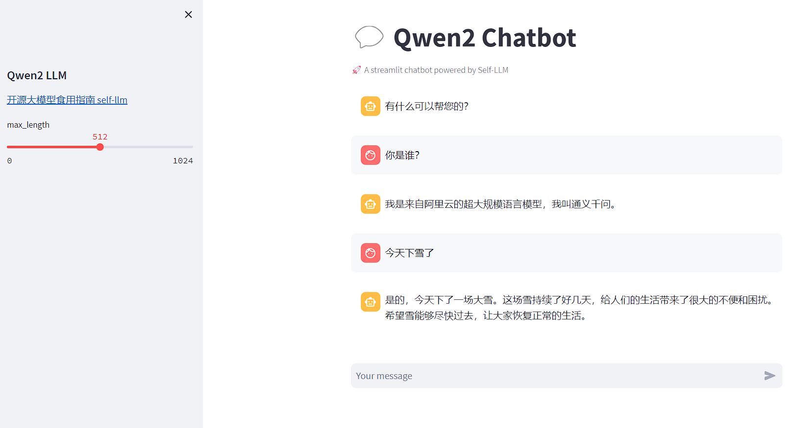

# 3、大模型部署与加速指南

本章内容参考DataWhale的[llm-universe](https://github.com/datawhalechina/llm-universe)，在此特别感谢，希望大家多多支持这个项目。

## 3.1. 大模型部署调用(以Qwen1.5为例)

> Qwen1.5 是 Qwen2 的测试版，Qwen1.5 是基于 transformer 的 decoder-only 语言模型，已在大量数据上进行了预训练。与之前发布的 Qwen 相比，Qwen1.5 的改进包括 6 种模型大小，包括 0.5B、1.8B、4B、7B、14B 和 72B；Chat模型在人类偏好方面的性能显著提高；基础模型和聊天模型均支持多种语言；所有大小的模型均稳定支持 32K 上下文长度，无需 trust_remote_code。

### 3.1.1 FastApi部署调用

#### 3.1.1.1 环境准备

在 Autodl 平台中租赁一个 3090 等 24G 显存的显卡机器，如下图所示镜像选择 PyTorch-->2.0.0-->3.8(ubuntu20.04)-->11.8（11.3 版本以上的都可以）。
接下来打开刚刚租用服务器的 JupyterLab，并且打开其中的终端开始环境配置、模型下载和运行演示。
pip换源加速下载并安装需要的依赖包

```shell
# 升级pip
pythhon -m pip install --upgrade pip
# 更换pip源加速下载
pip  config set global.index-url https://pypi.tuna.tsinghua.edu.cn/simple

# 安装依赖包
pip install fastapi== 0.104.1
pip install uvicorn==0.24.0.post1
pip install requests==2.25.1
pip install modelscope==1.11.0
pip install transformers==4.37.0
pip install streamlit==1.24.0
pip install sentencepiece==0.1.99
pip install accelerate==0.24.1
pip install transformers_stream_generator==0.0.4
```

#### 3.1.1.2 模型下载

使用modelscope中的snapshot_download下载模型，第一个参数为模型名称，参数cache_dir为模型的下载路径。
在文件下新建model_download.py文件，并写入一下代码。在终端执行python model_download.py即可下载模型。

```python
import torch 
from modelscope import snapshot_download, AutoModel, AutoTokenizer
import os
model_dir = snapshot_download('qwen/Qwen-1.5B-Chat',cache_dir = '/root.auto-tmp',revision='master')
```

#### 3.1.1.3 代码准备

在 /root/autodl-tmp 路径下新建 api.py 文件并在其中输入以下内容，粘贴代码后请及时保存文件。下面的代码有很详细的注释，大家如有不理解的地方，欢迎提出 issue。

```python
from fastapi import FastAPI, Request
from transformers import AutoTokenizer, AutoModelForCausalLM, GenerationConfig
import uvicorn
import json
import datetime
import torch

# 设置设备参数
DEVICE = "cuda"  # 使用CUDA
DEVICE_ID = "0"  # CUDA设备ID，如果未设置则为空
CUDA_DEVICE = f"{DEVICE}:{DEVICE_ID}" if DEVICE_ID else DEVICE  # 组合CUDA设备信息

# 清理GPU内存函数
def torch_gc():
    if torch.cuda.is_available():  # 检查是否可用CUDA
        with torch.cuda.device(CUDA_DEVICE):  # 指定CUDA设备
            torch.cuda.empty_cache()  # 清空CUDA缓存
            torch.cuda.ipc_collect()  # 收集CUDA内存碎片

# 创建FastAPI应用
app = FastAPI()

# 处理POST请求的端点
@app.post("/")
async def create_item(request: Request):
    global model, tokenizer  # 声明全局变量以便在函数内部使用模型和分词器
    json_post_raw = await request.json()  # 获取POST请求的JSON数据
    json_post = json.dumps(json_post_raw)  # 将JSON数据转换为字符串
    json_post_list = json.loads(json_post)  # 将字符串转换为Python对象
    prompt = json_post_list.get('prompt')  # 获取请求中的提示

    messages = [
            {"role": "system", "content": "You are a helpful assistant."},
            {"role": "user", "content": prompt}
    ]

    # 调用模型进行对话生成
    input_ids = tokenizer.apply_chat_template(messages,tokenize=False,add_generation_prompt=True)
    model_inputs = tokenizer([input_ids], return_tensors="pt").to('cuda')
    generated_ids = model.generate(model_inputs.input_ids,max_new_tokens=512)
    generated_ids = [
        output_ids[len(input_ids):] for input_ids, output_ids in zip(model_inputs.input_ids, generated_ids)
    ]
    response = tokenizer.batch_decode(generated_ids, skip_special_tokens=True)[0]
    now = datetime.datetime.now()  # 获取当前时间
    time = now.strftime("%Y-%m-%d %H:%M:%S")  # 格式化时间为字符串
    # 构建响应JSON
    answer = {
        "response": response,
        "status": 200,
        "time": time
    }
    # 构建日志信息
    log = "[" + time + "] " + '", prompt:"' + prompt + '", response:"' + repr(response) + '"'
    print(log)  # 打印日志
    torch_gc()  # 执行GPU内存清理
    return answer  # 返回响应

# 主函数入口
if __name__ == '__main__':
    # 加载预训练的分词器和模型
    model_name_or_path = '/root/autodl-tmp/qwen/Qwen1.5-7B-Chat'
    tokenizer = AutoTokenizer.from_pretrained(model_name_or_path, use_fast=False)
    model = AutoModelForCausalLM.from_pretrained(model_name_or_path, device_map="auto", torch_dtype=torch.bfloat16)

    # 启动FastAPI应用
    # 用6006端口可以将autodl的端口映射到本地，从而在本地使用api
    uvicorn.run(app, host='0.0.0.0', port=6006, workers=1)  # 在指定端口和主机上启动应用
```

#### 3.1.1.4 Api部署

在终端执行以下命令启动FastAPI应用：

```shell
cd /root/autodl-tmp
python api.py
```

默认部署在 6006 端口，通过 POST 方法进行调用，可以使用 curl 调用，如下所示：

```shell
curl -X POST "http://127.0.0.1:6006" \
     -H 'Content-Type: application/json' \
     -d '{"prompt": "你好"}'
```

也可以使用 python 中的 requests 库进行调用，如下所示：

```python
import requests
import json

def get_completion(prompt):
    headers = {'Content-Type': 'application/json'}
    data = {"prompt": prompt}
    response = requests.post(url='http://127.0.0.1:6006', headers=headers, data=json.dumps(data))
    return response.json()['response']

if __name__ == '__main__':
    print(get_completion('你好'))
```

得到的返回值如下所示：

```json
{"response":"你好！有什么我可以帮助你的吗？","status":200,"time":"2024-02-05 18:08:19"}
```

### 3.1.2 WebDemo部署

#### 3.1.2.1 环境准备

在autodl平台中租一个3090等24G显存的显卡机器，如下图所示镜像选择PyTorch-->2.0.0-->3.8(ubuntu20.04)-->11.8（11.3版本以上的都可以）
接下来打开刚刚租用服务器的JupyterLab， 图像 并且打开其中的终端开始环境配置、模型下载和运行演示。

pip换源和安装依赖包

```
# 升级pip
python -m pip install --upgrade pip
# 更换 pypi 源加速库的安装
pip config set global.index-url https://pypi.tuna.tsinghua.edu.cn/simple

pip install modelscope==1.9.5
pip install "transformers>=4.37.0"
pip install streamlit==1.24.0
pip install sentencepiece==0.1.99
pip install accelerate==0.24.1
pip install transformers_stream_generator==0.0.4
```

#### 3.1.2.2 模型下载

使用 modelscope 中的snapshot_download函数下载模型，第一个参数为模型名称，参数cache_dir为模型的下载路径。

在 /root/autodl-tmp 路径下新建 download.py 文件并在其中输入以下内容，粘贴代码后记得保存文件，如下图所示。并运行 python /root/autodl-tmp/download.py 执行下载，下载模型大概需要 2 分钟。

```python
import torch
from modelscope import snapshot_download, AutoModel, AutoTokenizer
from modelscope import GenerationConfig
model_dir = snapshot_download('qwen/Qwen1.5-7B-Chat', cache_dir='/root/autodl-tmp', revision='master')
```

#### 3.1.2.3 代码准备

在 `/root/autodl-tmp`路径下新建 `chatBot.py` 文件并在其中输入以下内容，粘贴代码后记得保存文件。

```python
# 导入所需的库
from transformers import AutoTokenizer, AutoModelForCausalLM, GenerationConfig
import torch
import streamlit as st

# 在侧边栏中创建一个标题和一个链接
with st.sidebar:
    st.markdown("## Qwen1.5 LLM")
    "[开源大模型食用指南 self-llm](https://github.com/datawhalechina/self-llm.git)"
    # 创建一个滑块，用于选择最大长度，范围在0到1024之间，默认值为512
    max_length = st.slider("max_length", 0, 1024, 512, step=1)

# 创建一个标题和一个副标题
st.title("💬 Qwen1.5 Chatbot")
st.caption("🚀 A streamlit chatbot powered by Self-LLM")

# 定义模型路径
mode_name_or_path = '/root/autodl-tmp/qwen/Qwen1.5-7B-Chat'

# 定义一个函数，用于获取模型和tokenizer
@st.cache_resource
def get_model():
    # 从预训练的模型中获取tokenizer
    tokenizer = AutoTokenizer.from_pretrained(mode_name_or_path, use_fast=False)
    # 从预训练的模型中获取模型，并设置模型参数
    model = AutoModelForCausalLM.from_pretrained(mode_name_or_path, torch_dtype=torch.bfloat16,  device_map="auto")
  
    return tokenizer, model

# 加载Qwen1.5-4B-Chat的model和tokenizer
tokenizer, model = get_model()

# 如果session_state中没有"messages"，则创建一个包含默认消息的列表
if "messages" not in st.session_state:
    st.session_state["messages"] = [{"role": "assistant", "content": "有什么可以帮您的？"}]

# 遍历session_state中的所有消息，并显示在聊天界面上
for msg in st.session_state.messages:
    st.chat_message(msg["role"]).write(msg["content"])

# 如果用户在聊天输入框中输入了内容，则执行以下操作
if prompt := st.chat_input():
    # 将用户的输入添加到session_state中的messages列表中
    st.session_state.messages.append({"role": "user", "content": prompt})
    # 在聊天界面上显示用户的输入
    st.chat_message("user").write(prompt)
  
    # 构建输入   
    input_ids = tokenizer.apply_chat_template(st.session_state.messages,tokenize=False,add_generation_prompt=True)
    model_inputs = tokenizer([input_ids], return_tensors="pt").to('cuda')
    generated_ids = model.generate(model_inputs.input_ids, max_new_tokens=512)
    generated_ids = [
        output_ids[len(input_ids):] for input_ids, output_ids in zip(model_inputs.input_ids, generated_ids)
    ]
    response = tokenizer.batch_decode(generated_ids, skip_special_tokens=True)[0]
    # 将模型的输出添加到session_state中的messages列表中
    st.session_state.messages.append({"role": "assistant", "content": response})
    # 在聊天界面上显示模型的输出
    st.chat_message("assistant").write(response)
    # print(st.session_state)
```

#### 3.1.2.4 运行demo

在终端中运行以下命令，启动streamlit	服务，并按照 `autodl` 的指示将端口映射到本地，然后在浏览器中打开链接 http://localhost:6006/ ，即可看到聊天界面。

```bash
streamlit run /root/autodl-tmp/chatBot.py --server.address 127.0.0.1 --server.port 6006
```

如下所示：


## 3.2 大模型加速

### 3.2.1 获取和编译llama.cpp

#### 3.2.1.1 克隆llama.cpp仓库

```shell
git clone https://github.com/ggerganov/llama.cpp
cd llama.cpp
```

#### 3.2.1.2 编译llama.cpp

在llama.cpp目录下执行以下命令：

```shell
make
```

### 3.2.2  下载qwen模型

#### 3.2.2.1 安装lfs

```shell
curl -s https://packagecloud.io/install/repositories/github/git-lfs/script.deb.sh | sudo bash
sudo apt-get install git-lfs
git lfs install
```

#### 3.2.2.2 模型下载

新建model_download.py文件并在文件内输入以下内容：

```python
from modelscope.hub.file_download import model_file_download
 
model_dir = model_file_download(model_id='qwen/Qwen2-7B-Instruct-GGUF',
                                file_path='qwen2-7b-instruct-q5_k_m.gguf',
                                revision='master',
                                cache_dir='/root/autodl-tmp')

```

执行python model_download.py

### 3.2.3 使用llama.cpp进行推理

```shell
./llama-cli -m /root/autodl-tmp/qwen/Qwen2-7B-Instruct-GGUF/qwen2-7b-instruct-q5_k_m.gguf \
  -n 512 -co -i -if -f prompts/chat-with-qwen.txt \
  --in-prefix "<|im_start|>user\n" \
  --in-suffix "<|im_end|>\n<|im_start|>assistant\n" \
  -ngl 24 -fa
```

<div align="center">

</div>
