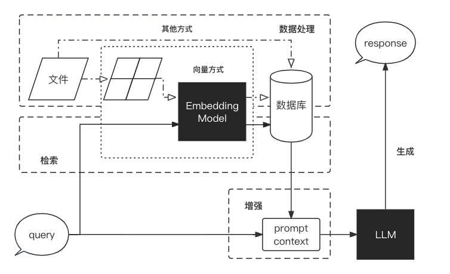

# 4、大语言模型微调

## 4.1 Lora微调

本章节基于Qwen1.5-7B-chat进行Lora微调
在本节中，我们简单介绍如何基于Transformer、peft等框架，对Qwen模型进行Lora微调。Lora是一种高效的微调方法，深入了解其原理，可参考博客：[知乎|深入浅出Lora](https://zhuanlan.zhihu.com/p/650197598)

### 4.1 环境配置

在完成基本环境配置和本地模型部署的情况下，你还需要安装一些第三方库，可以使用以下命令：

```bash
python -m pip install --upgrade pip
# 更换 pypi 源加速库的安装
pip config set global.index-url https://pypi.tuna.tsinghua.edu.cn/simple
pip install modelscope==1.9.5
pip install "transformers>=4.37.0"
pip install streamlit==1.24.0
pip install sentencepiece==0.1.99
pip install accelerate==0.24.1
pip install transformers_stream_generator==0.0.4
pip install datasets==2.18.0
pip install peft==0.10.0
MAX_JOBS=8 pip install flash-attn --no-build-isolation
```

> 注意：flash-attn 安装会比较慢，大概需要十几分钟。
> 我们将微调数据集放置在根目录 [/dataset](../dataset/huanhuan.json)。

### 4.2 指令集构建

LLM 的微调一般指指令微调过程。所谓指令微调，是说我们使用的微调数据形如：

```json
{
    "instruction":"回答以下用户问题，仅输出答案。",
    "input":"1+1等于几?",
    "output":"2"
}
```

其中，`instruction` 是用户指令，告知模型其需要完成的任务；`input` 是用户输入，是完成用户指令所必须的输入内容；`output` 是模型应该给出的输出。

即我们的核心训练目标是让模型具有理解并遵循用户指令的能力。因此，在指令集构建时，我们应针对我们的目标任务，针对性构建任务指令集。例如，在本节我们使用开源的 [Chat-甄嬛](https://github.com/KMnO4-zx/huanhuan-chat) 项目作为示例，我们的目标是构建一个能够模拟甄嬛对话风格的个性化 LLM，因此我们构造的指令形如：

```json
{
    "instruction": "你是谁？",
    "input":"",
    "output":"家父是大理寺少卿甄远道。"
}
```

### 4.3 数据格式化

`Lora` 训练的数据是需要经过格式化、编码之后再输入给模型进行训练的，我们一般需要将输入文本编码为 input_ids，将输出文本编码为 `labels`，编码之后的结果都是多维的向量。
首先定义一个预处理函数，这个函数用于对每一个样本，编码其输入、输出文本并返回一个编码后的字典：

```python
def process_func(example):
    MAX_LENGTH = 384    # Llama分词器会将一个中文字切分为多个token，因此需要放开一些最大长度，保证数据的完整性
    input_ids, attention_mask, labels = [], [], []
    instruction = tokenizer(f"<|im_start|>system\n现在你要扮演皇帝身边的女人--甄嬛<|im_end|>\n<|im_start|>user\n{example['instruction'] + example['input']}<|im_end|>\n<|im_start|>assistant\n", add_special_tokens=False)  # add_special_tokens 不在开头加 special_tokens
    response = tokenizer(f"{example['output']}", add_special_tokens=False)
    input_ids = instruction["input_ids"] + response["input_ids"] + [tokenizer.pad_token_id]
    attention_mask = instruction["attention_mask"] + response["attention_mask"] + [1]  # 因为eos token咱们也是要关注的所以 补充为1
    labels = [-100] * len(instruction["input_ids"]) + response["input_ids"] + [tokenizer.pad_token_id]  
    if len(input_ids) > MAX_LENGTH:  # 做一个截断
        input_ids = input_ids[:MAX_LENGTH]
        attention_mask = attention_mask[:MAX_LENGTH]
        labels = labels[:MAX_LENGTH]
    return {
        "input_ids": input_ids,
        "attention_mask": attention_mask,
        "labels": labels
    }
```

`Qwen1.5` 采用的 `Prompt Template`格式如下：

```text
<|im_start|>system
You are a helpful assistant.<|im_end|>
<|im_start|>user
你是谁？<|im_end|>
<|im_start|>assistant
我是一个有用的助手。<|im_end|>
```

### 4.4 加载tokenizer和半精度模型

模型以半精度形式加载，如果显卡支持的话，可以用 `torch.bfolat`形式加载。对于自定义的模型一定要指定 `trust_remote_code`参数为 `True`。

```python
tokenizer = AutoTokenizer.from_pretrained('./qwen/Qwen1.5-7B-Chat/', use_fast=False, trust_remote_code=True)

model = AutoModelForCausalLM.from_pretrained('./qwen/Qwen1.5-7B-Chat/', device_map="auto",torch_dtype=torch.bfloat16)
```

### 4.5 定义LoraConfig

`LoraConfig`这个类中可以设置很多参数，但主要的参数没多少，简单讲一讲，感兴趣的同学可以直接看源码。

- `task_type`：模型类型
- `target_modules`：需要训练的模型层的名字，主要就是 `attention`部分的层，不同的模型对应的层的名字不同，可以传入数组，也可以字符串，也可以正则表达式。
- `r`：`lora`的秩，具体可以看 `Lora`原理
- `lora_alpha`：`Lora alaph`，具体作用参见 `Lora` 原理

`Lora`的缩放是啥嘞？当然不是 `r`（秩），这个缩放就是 `lora_alpha/r`, 在这个 `LoraConfig`中缩放就是4倍。

```python
config = LoraConfig(
    task_type=TaskType.CAUSAL_LM, 
    target_modules=["q_proj", "k_proj", "v_proj", "o_proj", "gate_proj", "up_proj", "down_proj"],
    inference_mode=False, # 训练模式
    r=8, # Lora 秩
    lora_alpha=32, # Lora alaph，具体作用参见 Lora 原理
    lora_dropout=0.1# Dropout 比例
)
```

### 4.6 自定义 TrainingArguments 参数

`TrainingArguments`这个类的源码也介绍了每个参数的具体作用，当然大家可以来自行探索，这里就简单说几个常用的。

- `output_dir`：模型的输出路径
- `per_device_train_batch_size`：顾名思义 `batch_size`
- `gradient_accumulation_steps`: 梯度累加，如果你的显存比较小，那可以把 `batch_size` 设置小一点，梯度累加增大一些。
- `logging_steps`：多少步，输出一次 `log`
- `num_train_epochs`：顾名思义 `epoch`
- `gradient_checkpointing`：梯度检查，这个一旦开启，模型就必须执行 `model.enable_input_require_grads()`，这个原理大家可以自行探索，这里就不细说了。

```python
args = TrainingArguments(
    output_dir="./output/DeepSeek",
    per_device_train_batch_size=4,
    gradient_accumulation_steps=4,
    logging_steps=10,
    num_train_epochs=3,
    save_steps=100,
    learning_rate=1e-4,
    save_on_each_node=True,
    gradient_checkpointing=True
)
```

### 4.7 使用Trainer训练

```python
trainer = Trainer(
    model=model,
    args=args,
    train_dataset=tokenized_id,
    data_collator=DataCollatorForSeq2Seq(tokenizer=tokenizer, padding=True),
)
trainer.train()
```

### 4.8 加载lora权重推理

训练好了之后可以使用如下方式加载 `lora`权重进行推理：

```python
from transformers import AutoModelForCausalLM, AutoTokenizer
import torch
from peft import PeftModel

model_path = './qwen/Qwen1.5-7B-Chat/'
lora_path = 'lora_path'

# 加载tokenizer
tokenizer = AutoTokenizer.from_pretrained(model_path)

# 加载模型
model = AutoModelForCausalLM.from_pretrained(model_path, device_map="auto",torch_dtype=torch.bfloat16)

# 加载lora权重
model = PeftModel.from_pretrained(model, model_id=lora_path, config=config)

prompt = "你是谁？"
messages = [
    {"role": "system", "content": "现在你要扮演皇帝身边的女人--甄嬛"},
    {"role": "user", "content": prompt}
]

text = tokenizer.apply_chat_template(messages, tokenize=False, add_generation_prompt=True)

model_inputs = tokenizer([text], return_tensors="pt").to('cuda')

generated_ids = model.generate(
    model_inputs.input_ids,
    max_new_tokens=512
)
generated_ids = [
    output_ids[len(input_ids):] for input_ids, output_ids in zip(model_inputs.input_ids, generated_ids)
]

response = tokenizer.batch_decode(generated_ids, skip_special_tokens=True)[0]

print(response)
```

### 4.9 完整代码

```python
## 导入需要的库
from datasets import Dataset
import pandas as pd
from transformers import AutoTokenizer, AutoModelForCausalLM, DataCollatorForSeq2Seq, TrainingArguments, Trainer, GenerationConfig

# 将JSON文件转换为CSV文件
df = pd.read_json('./huanhuan.json')
ds = Dataset.from_pandas(df)

# ds[：3]
# {'instruction': ['小姐，别的秀女都在求中选，唯有咱们小姐想被撂牌子，菩萨一定记得真真儿的——',
#   '这个温太医啊，也是古怪，谁不知太医不得皇命不能为皇族以外的人请脉诊病，他倒好，十天半月便往咱们府里跑。',
#   '嬛妹妹，刚刚我去府上请脉，听甄伯母说你来这里进香了。'],
#  'input': ['', '', ''],
#  'output': ['嘘——都说许愿说破是不灵的。', '你们俩话太多了，我该和温太医要一剂药，好好治治你们。', '出来走走，也是散心。']}

## 处理数据集
tokenizer = AutoTokenizer.from_pretrained('./qwen/Qwen1.5-7B-Chat/', use_fast=False, trust_remote_code=True)

# tokenizer
# Qwen2Tokenizer(name_or_path='./qwen/Qwen1.5-7B-Chat/', vocab_size=151643, model_max_length=32768, is_fast=False, padding_side='right', truncation_side='right', special_tokens={'eos_token': '<|endoftext|>', 'pad_token': '<|endoftext|>', 'additional_special_tokens': ['<|im_start|>', '<|im_end|>']}, clean_up_tokenization_spaces=False),  added_tokens_decoder={
# 	151643: AddedToken("<|endoftext|>", rstrip=False, lstrip=False, single_word=False, normalized=False, special=True),
# 	151644: AddedToken("<|im_start|>", rstrip=False, lstrip=False, single_word=False, normalized=False, special=True),
# 	151645: AddedToken("<|im_end|>", rstrip=False, lstrip=False, single_word=False, normalized=False, special=True),
# }

def process_func(example):
    MAX_LENGTH = 384    # Llama分词器会将一个中文字切分为多个token，因此需要放开一些最大长度，保证数据的完整性
    input_ids, attention_mask, labels = [], [], []
    instruction = tokenizer(f"<|im_start|>system\n现在你要扮演皇帝身边的女人--甄嬛<|im_end|>\n<|im_start|>user\n{example['instruction'] + example['input']}<|im_end|>\n<|im_start|>assistant\n", add_special_tokens=False)  # add_special_tokens 不在开头加 special_tokens
    response = tokenizer(f"{example['output']}", add_special_tokens=False)
    input_ids = instruction["input_ids"] + response["input_ids"] + [tokenizer.pad_token_id]
    attention_mask = instruction["attention_mask"] + response["attention_mask"] + [1]  # 因为eos token咱们也是要关注的所以 补充为1
    labels = [-100] * len(instruction["input_ids"]) + response["input_ids"] + [tokenizer.pad_token_id]  
    if len(input_ids) > MAX_LENGTH:  # 做一个截断
        input_ids = input_ids[:MAX_LENGTH]
        attention_mask = attention_mask[:MAX_LENGTH]
        labels = labels[:MAX_LENGTH]
    return {
        "input_ids": input_ids,
        "attention_mask": attention_mask,
        "labels": labels
    }

tokenized_id = ds.map(process_func, remove_columns=ds.column_names)

# tokenized_id
# Dataset({
#     features: ['input_ids', 'attention_mask', 'labels'],
#     num_rows: 3729
# })

# tokenizer.decode(tokenized_id[0]['input_ids'])
# '<|im_start|>system\n现在你要扮演皇帝身边的女人--甄嬛<|im_end|>\n<|im_start|>user\n小姐，别的秀女都在求中选，唯有咱们小姐想被撂牌子，菩萨一定记得真真儿的——<|im_end|>\n<|im_start|>assistant\n嘘——都说许愿说破是不灵的。<|endoftext|>'

# tokenizer.decode(list(filter(lambda x: x != -100, tokenized_id[1]["labels"])))
# '你们俩话太多了，我该和温太医要一剂药，好好治治你们。<|endoftext|>'

## 创建模型
import torch

model = AutoModelForCausalLM.from_pretrained('./qwen/Qwen1.5-7B-Chat/', device_map="auto",torch_dtype=torch.bfloat16)

# model
# Qwen2ForCausalLM(
#   (model): Qwen2Model(
#     (embed_tokens): Embedding(151936, 4096)
#     (layers): ModuleList(
#       (0-31): 32 x Qwen2DecoderLayer(
#         (self_attn): Qwen2Attention(
#           (q_proj): Linear(in_features=4096, out_features=4096, bias=True)
#           (k_proj): Linear(in_features=4096, out_features=4096, bias=True)
#           (v_proj): Linear(in_features=4096, out_features=4096, bias=True)
#           (o_proj): Linear(in_features=4096, out_features=4096, bias=False)
#           (rotary_emb): Qwen2RotaryEmbedding()
#         )
#         (mlp): Qwen2MLP(
#           (gate_proj): Linear(in_features=4096, out_features=11008, bias=False)
#           (up_proj): Linear(in_features=4096, out_features=11008, bias=False)
#           (down_proj): Linear(in_features=11008, out_features=4096, bias=False)
#           (act_fn): SiLU()
#         )
#         (input_layernorm): Qwen2RMSNorm()
#         (post_attention_layernorm): Qwen2RMSNorm()
#       )
#     )
#     (norm): Qwen2RMSNorm()
#   )
#   (lm_head): Linear(in_features=4096, out_features=151936, bias=False)
# )

model.enable_input_require_grads() # 开启梯度检查点时，要执行该方法
model.dtype # torch.bfloat16

## Lora训练
from peft import LoraConfig

config = LoraConfig(
    task_type=TaskType.CAUSAL_LM, 
    target_modules=["q_proj", "k_proj", "v_proj", "o_proj", "gate_proj", "up_proj", "down_proj"],
    inference_mode=False, # 训练模式
    r=8, # Lora 秩
    lora_alpha=32, # Lora alaph，具体作用参见 Lora 原理
    lora_dropout=0.1# Dropout 比例
)

# config
# LoraConfig(peft_type=<PeftType.LORA: 'LORA'>, auto_mapping=None, base_model_name_or_path=None, revision=None, task_type=<TaskType.CAUSAL_LM: 'CAUSAL_LM'>, inference_mode=False, r=8, target_modules={'gate_proj', 'q_proj', 'k_proj', 'o_proj', 'down_proj', 'v_proj', 'up_proj'}, lora_alpha=32, lora_dropout=0.1, fan_in_fan_out=False, bias='none', use_rslora=False, modules_to_save=None, init_lora_weights=True, layers_to_transform=None, layers_pattern=None, rank_pattern={}, alpha_pattern={}, megatron_config=None, megatron_core='megatron.core', loftq_config={})

model = get_peft_model(model, config)

# config
# LoraConfig(peft_type=<PeftType.LORA: 'LORA'>, auto_mapping=None, base_model_name_or_path='./qwen/Qwen1.5-7B-Chat/', revision=None, task_type=<TaskType.CAUSAL_LM: 'CAUSAL_LM'>, inference_mode=False, r=8, target_modules={'gate_proj', 'q_proj', 'k_proj', 'o_proj', 'down_proj', 'v_proj', 'up_proj'}, lora_alpha=32, lora_dropout=0.1, fan_in_fan_out=False, bias='none', use_rslora=False, modules_to_save=None, init_lora_weights=True, layers_to_transform=None, layers_pattern=None, rank_pattern={}, alpha_pattern={}, megatron_config=None, megatron_core='megatron.core', loftq_config={})

model.print_trainable_parameters()
# trainable params: 19,988,480 || all params: 7,741,313,024 || trainable%: 0.2582052933143348


## 配置训练参数
args = TrainingArguments(
    output_dir="./output/Qwen1.5",
    per_device_train_batch_size=4,
    gradient_accumulation_steps=4,
    logging_steps=10,
    num_train_epochs=3,
    save_steps=100,
    learning_rate=1e-4,
    save_on_each_node=True,
    gradient_checkpointing=True
)

trainer = Trainer(
    model=model,
    args=args,
    train_dataset=tokenized_id,
    data_collator=DataCollatorForSeq2Seq(tokenizer=tokenizer, padding=True),
)

trainer.train()


## 完成训练后合并加载模型与Lora权重

from transformers import AutoModelForCausalLM, AutoTokenizer
import torch
from peft import PeftModel

mode_path = '/root/autodl-tmp/qwen/Qwen2-7B-Instruct/'
lora_path = './output/Qwen2_instruct_lora/checkpoint-10' # 这里改称你的 lora 输出对应 checkpoint 地址

# 加载tokenizer
tokenizer = AutoTokenizer.from_pretrained(mode_path, trust_remote_code=True)

# 加载模型
model = AutoModelForCausalLM.from_pretrained(mode_path, device_map="auto",torch_dtype=torch.bfloat16, trust_remote_code=True).eval()

# 加载lora权重
model = PeftModel.from_pretrained(model, model_id=lora_path)

prompt = "你是谁？"
inputs = tokenizer.apply_chat_template([{"role": "user", "content": "假设你是皇帝身边的女人--甄嬛。"},{"role": "user", "content": prompt}],
                                       add_generation_prompt=True,
                                       tokenize=True,
                                       return_tensors="pt",
                                       return_dict=True
                                       ).to('cuda')


gen_kwargs = {"max_length": 2500, "do_sample": True, "top_k": 1}
with torch.no_grad():
    outputs = model.generate(**inputs, **gen_kwargs)
    outputs = outputs[:, inputs['input_ids'].shape[1]:]
    print(tokenizer.decode(outputs[0], skip_special_tokens=True))

```

## 4.2 RAG

### 4.2.1 什么是RAG

大型语言模型（LLM）相较于传统的语言模型具有更强大的能力，然而在某些情况下，它们仍可能无法提供准确的答案。为了解决大型语言模型在生成文本时面临的一系列挑战，提高模型的性能和输出质量，研究人员提出了一种新的模型架构：**检索增强生成（RAG, Retrieval-Augmented Generation）**。该架构巧妙地**整合了从庞大知识库中检索到的相关信息，并以此为基础，指导大型语言模型生成更为精准的答案**，从而显著提升了回答的准确性与深度。

目前 LLM 面临的主要问题有：

- **信息偏差/幻觉：** LLM 有时会产生与客观事实不符的信息，导致用户接收到的信息不准确。RAG 通过检索数据源，辅助模型生成过程，确保输出内容的精确性和可信度，减少信息偏差。
- **知识更新滞后性：** LLM 基于静态的数据集训练，这可能导致模型的知识更新滞后，无法及时反映最新的信息动态。RAG 通过实时检索最新数据，保持内容的时效性，确保信息的持续更新和准确性。
- **内容不可追溯：** LLM 生成的内容往往缺乏明确的信息来源，影响内容的可信度。RAG 将生成内容与检索到的原始资料建立链接，增强了内容的可追溯性，从而提升了用户对生成内容的信任度。
- **领域专业知识能力欠缺：** LLM 在处理特定领域的专业知识时，效果可能不太理想，这可能会影响到其在相关领域的回答质量。RAG 通过检索特定领域的相关文档，为模型提供丰富的上下文信息，从而提升了在专业领域内的问题回答质量和深度。
- **推理能力限制：** 面对复杂问题时，LLM 可能缺乏必要的推理能力，这影响了其对问题的理解和回答。RAG 结合检索到的信息和模型的生成能力，通过提供额外的背景知识和数据支持，增强了模型的推理和理解能力。
- **应用场景适应性受限：** LLM 需在多样化的应用场景中保持高效和准确，但单一模型可能难以全面适应所有场景。RAG 使得 LLM 能够通过检索对应应用场景数据的方式，灵活适应问答系统、推荐系统等多种应用场景。
- **长文本处理能力较弱：** LLM 在理解和生成长篇内容时受限于有限的上下文窗口，且必须按顺序处理内容，输入越长，速度越慢。RAG 通过检索和整合长文本信息，强化了模型对长上下文的理解和生成，有效突破了输入长度的限制，同时降低了调用成本，并提升了整体的处理效率。

### 4.2.2 RAG工作流程

RAG 是一个完整的系统，其工作流程可以简单地分为数据处理、检索、增强和生成四个阶段：

<div align=center>

</div>

1. **数据处理阶段**
   1. 对原始数据进行清洗和处理。
   2. 将处理后的数据转化为检索模型可以使用的格式。
   3. 将处理后的数据存储在对应的数据库中。
2. **检索阶段**
   1. 将用户的问题输入到检索系统中，从数据库中检索相关信息。
3. **增强阶段**
   1. 对检索到的信息进行处理和增强，以便生成模型可以更好地理解和使用。
4. **生成阶段**
   1. 将增强后的信息输入到生成模型中，生成模型根据这些信息生成答案。

### 4.2.3 RAG与Finetune

在提升大语言模型效果中，RAG 和 微调（Finetune）是两种主流的方法。

**微调**: 通过在特定数据集上进一步训练大语言模型，来提升模型在特定任务上的表现。

RAG 和 微调的对比可以参考下表（表格来源[[1](https://arxiv.org/abs/2312.10997)][[2](https://baoyu.io/translations/ai-paper/2312.10997-retrieval-augmented-generation-for-large-language-models-a-survey)]）

| 特征比较 | RAG                                                                    | 微调                                                                       |
| -------- | ---------------------------------------------------------------------- | -------------------------------------------------------------------------- |
| 知识更新 | 直接更新检索知识库，无需重新训练。信息更新成本低，适合动态变化的数据。 | 通常需要重新训练来保持知识和数据的更新。更新成本高，适合静态数据。         |
| 外部知识 | 擅长利用外部资源，特别适合处理文档或其他结构化/非结构化数据库。        | 将外部知识学习到 LLM 内部。                                                |
| 数据处理 | 对数据的处理和操作要求极低。                                           | 依赖于构建高质量的数据集，有限的数据集可能无法显著提高性能。               |
| 模型定制 | 侧重于信息检索和融合外部知识，但可能无法充分定制模型行为或写作风格。   | 可以根据特定风格或术语调整 LLM 行为、写作风格或特定领域知识。              |
| 可解释性 | 可以追溯到具体的数据来源，有较好的可解释性和可追踪性。                 | 黑盒子，可解释性相对较低。                                                 |
| 计算资源 | 需要额外的资源来支持检索机制和数据库的维护。                           | 依赖高质量的训练数据集和微调目标，对计算资源的要求较高。                   |
| 推理延迟 | 增加了检索步骤的耗时                                                   | 单纯 LLM 生成的耗时                                                        |
| 降低幻觉 | 通过检索到的真实信息生成回答，降低了产生幻觉的概率。                   | 模型学习特定领域的数据有助于减少幻觉，但面对未见过的输入时仍可能出现幻觉。 |
| 伦理隐私 | 检索和使用外部数据可能引发伦理和隐私方面的问题。                       | 训练数据中的敏感信息需要妥善处理，以防泄露。                               |

### 4.2.4 RAG应用案例

[Datawhale 知识库助手](https://github.com/logan-zou/Chat_with_Datawhale_langchain) 是结合本课程内容、在由[散步](https://github.com/sanbuphy)打造的 [ChatWithDatawhale](https://github.com/sanbuphy/ChatWithDatawhale)

整个 RAG 过程包括如下操作：
1.用户提出问题 Query
2.加载和读取知识库文档
3.对知识库文档进行分割
4.对分割后的知识库文本向量化并存入向量库建立索引
5.对问句 Query 向量化
6.在知识库文档向量中匹配出与问句 Query 向量最相似的 top k 个
7.匹配出的知识库文本文本作为上下文 Context 和问题⼀起添加到 prompt 中
8.提交给 LLM 生成回答 Answer
可以大致分为索引，检索和生成三个阶段，这三个阶段将在下面小节配合该 llm-universe 知识库助手项目进行拆解。

#### 4.2.4.1 索引-indexing

本节讲述该项目 llm-universe 个人知识库助手：创建知识库并加载文件-读取文件-**文本分割**(Text splitter) ，知识库**文本向量化**(embedding)以及存储到**向量数据库**的实现，

其中**加载文件**：这是读取存储在本地的知识库文件的步骤。**读取文件**：读取加载的文件内容，通常是将其转化为文本格式 。**文本分割(Text splitter)**：按照⼀定的规则(例如段落、句子、词语等)将文本分割。**文本向量化：**这通常涉及到 NLP 的特征抽取，该项目通过本地 m3e 文本嵌入模型，openai，zhipuai 开源 api 等方法将分割好的文本转化为数值向量并存储到向量数据库

##### 4.2.4.1.1 知识库搭建-加载和读取

该项目llm-universe个人知识库助手选用 Datawhale 一些经典开源课程、视频（部分）作为示例，具体包括：

- [《机器学习公式详解》PDF版本](https://github.com/datawhalechina/pumpkin-book/releases)
- [《面向开发者的 LLM 入门教程 第一部分 Prompt Engineering》md版本](https://github.com/datawhalechina/prompt-engineering-for-developers)
- [《强化学习入门指南》MP4版本](https://www.bilibili.com/video/BV1HZ4y1v7eX/?spm_id_from=333.999.0.0&vd_source=4922e78f7a24c5981f1ddb6a8ee55ab9)
- 以及datawhale总仓库所有开源项目的readme https://github.com/datawhalechina

这些知识库源数据放置在 **../../dataset/knowledge_db** 目录下，用户也可以自己存放自己其他的文件。

**1**.下面讲一下如何获取 DataWhale 总仓库的所有开源项目的 readme ，用户可以通过先运行 **project/dataset/test_get_all_repo.py** 文件，用来获取 Datawhale 总仓库所有开源项目的 readme，代码如下：

```python
import json
import requests
import os
import base64
import loguru
from dotenv import load_dotenv
# 加载环境变量
load_dotenv()
# 从环境变量中获取TOKEN
TOKEN = os.getenv('TOKEN')
# 定义获取组织仓库的函数
def get_repos(org_name, token, export_dir):
    headers = {
        'Authorization': f'token {token}',
    }
    url = f'https://api.github.com/orgs/{org_name}/repos'
    response = requests.get(url, headers=headers, params={'per_page': 200, 'page': 0})
    if response.status_code == 200:
        repos = response.json()
        loguru.logger.info(f'Fetched {len(repos)} repositories for {org_name}.')
        # 使用 export_dir 确定保存仓库名的文件路径
        repositories_path = os.path.join(export_dir, 'repositories.txt')
        with open(repositories_path, 'w', encoding='utf-8') as file:
            for repo in repos:
                file.write(repo['name'] + '\n')
        return repos
    else:
        loguru.logger.error(f"Error fetching repositories: {response.status_code}")
        loguru.logger.error(response.text)
        return []
# 定义拉取仓库README文件的函数
def fetch_repo_readme(org_name, repo_name, token, export_dir):
    headers = {
        'Authorization': f'token {token}',
    }
    url = f'https://api.github.com/repos/{org_name}/{repo_name}/readme'
    response = requests.get(url, headers=headers)
    if response.status_code == 200:
        readme_content = response.json()['content']
        # 解码base64内容
        readme_content = base64.b64decode(readme_content).decode('utf-8')
        # 使用 export_dir 确定保存 README 的文件路径
        repo_dir = os.path.join(export_dir, repo_name)
        if not os.path.exists(repo_dir):
            os.makedirs(repo_dir)
        readme_path = os.path.join(repo_dir, 'README.md')
        with open(readme_path, 'w', encoding='utf-8') as file:
            file.write(readme_content)
    else:
        loguru.logger.error(f"Error fetching README for {repo_name}: {response.status_code}")
        loguru.logger.error(response.text)
# 主函数
if __name__ == '__main__':
    # 配置组织名称
    org_name = 'datawhalechina'
    # 配置 export_dir
    export_dir = "../../dataset/readme_db"  # 请替换为实际的目录路径
    # 获取仓库列表
    repos = get_repos(org_name, TOKEN, export_dir)
    # 打印仓库名称
    if repos:
        for repo in repos:
            repo_name = repo['name']
            # 拉取每个仓库的README
            fetch_repo_readme(org_name, repo_name, TOKEN, export_dir)
    # 清理临时文件夹
    # if os.path.exists('temp'):
    #     shutil.rmtree('temp')
```

默认会把这些readme文件放在同目录dataset下的readme_db文件。其中这些readme文件含有不少无关信息，即再运行**project/dataset/text_summary_readme.py文件**可以调用大模型生成每个readme文件的摘要并保存到上述知识库目录../../dataset/knowledge_db /readme_summary文件夹中，****。代码如下：

```python
import os
from dotenv import load_dotenv
import openai
from test_get_all_repo import get_repos
from bs4 import BeautifulSoup
import markdown
import re
import time
# Load environment variables
load_dotenv()
TOKEN = os.getenv('TOKEN')
# Set up the OpenAI API client
openai_api_key = os.environ["OPENAI_API_KEY"]

# 过滤文本中链接防止大语言模型风控
def remove_urls(text):
    # 正则表达式模式，用于匹配URL
    url_pattern = re.compile(r'https?://[^\s]*')
    # 替换所有匹配的URL为空字符串
    text = re.sub(url_pattern, '', text)
    # 正则表达式模式，用于匹配特定的文本
    specific_text_pattern = re.compile(r'扫描下方二维码关注公众号|提取码|关注|科学上网|回复关键词|侵权|版权|致谢|引用|LICENSE'
                                       r'|组队打卡|任务打卡|组队学习的那些事|学习周期|开源内容|打卡|组队学习|链接')
    # 替换所有匹配的特定文本为空字符串
    text = re.sub(specific_text_pattern, '', text)
    return text

# 抽取md中的文本
def extract_text_from_md(md_content):
    # Convert Markdown to HTML
    html = markdown.markdown(md_content)
    # Use BeautifulSoup to extract text
    soup = BeautifulSoup(html, 'html.parser')

    return remove_urls(soup.get_text())

def generate_llm_summary(repo_name, readme_content,model):
    prompt = f"1：这个仓库名是 {repo_name}. 此仓库的readme全部内容是: {readme_content}\
               2:请用约200以内的中文概括这个仓库readme的内容,返回的概括格式要求：这个仓库名是...,这仓库内容主要是..."
    openai.api_key = openai_api_key
    # 具体调用
    messages = [{"role": "system", "content": "你是一个人工智能助手"},
                {"role": "user", "content": prompt}]
    response = openai.ChatCompletion.create(
        model=model,
        messages=messages,
    )
    return response.choices[0].message["content"]

def main(org_name,export_dir,summary_dir,model):
    repos = get_repos(org_name, TOKEN, export_dir)

    # Create a directory to save summaries
    os.makedirs(summary_dir, exist_ok=True)

    for id, repo in enumerate(repos):
        repo_name = repo['name']
        readme_path = os.path.join(export_dir, repo_name, 'README.md')
        print(repo_name)
        if os.path.exists(readme_path):
            with open(readme_path, 'r', encoding='utf-8') as file:
                readme_content = file.read()
            # Extract text from the README
            readme_text = extract_text_from_md(readme_content)
            # Generate a summary for the README
            # 访问受限，每min一次
            time.sleep(60)
            print('第' + str(id) + '条' + 'summary开始')
            try:
                summary = generate_llm_summary(repo_name, readme_text,model)
                print(summary)
                # Write summary to a Markdown file in the summary directory
                summary_file_path = os.path.join(summary_dir, f"{repo_name}_summary.md")
                with open(summary_file_path, 'w', encoding='utf-8') as summary_file:
                    summary_file.write(f"# {repo_name} Summary\n\n")
                    summary_file.write(summary)
            except openai.OpenAIError as e:
                summary_file_path = os.path.join(summary_dir, f"{repo_name}_summary风控.md")
                with open(summary_file_path, 'w', encoding='utf-8') as summary_file:
                    summary_file.write(f"# {repo_name} Summary风控\n\n")
                    summary_file.write("README内容风控。\n")
                print(f"Error generating summary for {repo_name}: {e}")
                # print(readme_text)
        else:
            print(f"文件不存在: {readme_path}")
            # If README doesn't exist, create an empty Markdown file
            summary_file_path = os.path.join(summary_dir, f"{repo_name}_summary不存在.md")
            with open(summary_file_path, 'w', encoding='utf-8') as summary_file:
                summary_file.write(f"# {repo_name} Summary不存在\n\n")
                summary_file.write("README文件不存在。\n")
if __name__ == '__main__':
    # 配置组织名称
    org_name = 'datawhalechina'
    # 配置 export_dir
    export_dir = "../dataset/readme_db"  # 请替换为实际readme的目录路径
    summary_dir="../../dataset/knowledge_db/readme_summary"# 请替换为实际readme的概括的目录路径
    model="gpt-3.5-turbo"  #deepseek-chat,gpt-3.5-turbo,moonshot-v1-8k
    main(org_name,export_dir,summary_dir,model)

```

其中 **extract_text_from_md()** 函数用来抽取 md 文件中的文本， **remove_urls()** 函数过滤了 readme 文本中的一些网页链接以及过滤了可能引起大模型风控一些词汇。接着调用 generate_llm_summary() 让大模型生成每个 readme 的概括。

**2**.在上述知识库构建完毕之后，**../../dataset/knowledge_db** 目录下就有了 Datawhale 开源的所有项目的 readme 概括的 md 文件，以及[《机器学习公式详解》PDF版本](https://github.com/datawhalechina/pumpkin-book/releases)，[《面向开发者的 LLM 入门教程 第一部分 Prompt Engineering》md版本](https://github.com/datawhalechina/prompt-engineering-for-developers)，[《强化学习入门指南》MP4版本](https://www.bilibili.com/video/BV1HZ4y1v7eX/?spm_id_from=333.999.0.0&vd_source=4922e78f7a24c5981f1ddb6a8ee55ab9)等文件。

其中有 mp4 格式，md 格式，以及 pdf 格式，对这些文件的加载方式，该项目将代码放在了 **project/dataset/create_db.py文件** 下，部分代码如下。其中 pdf 格式文件用 PyMuPDFLoader 加载器，md格式文件用UnstructuredMarkdownLoader加载器。要注意的是其实数据处理是一件非常复杂和业务个性化的事，如pdf文件中包含图表，图片和文字以及不同层次标题，这些都需要根据业务进行精细化处理。

```python
from langchain.document_loaders import UnstructuredFileLoader
from langchain.document_loaders import UnstructuredMarkdownLoader
from langchain.text_splitter import RecursiveCharacterTextSplitter
from langchain.document_loaders import PyMuPDFLoader
from langchain.vectorstores import Chroma
# 首先实现基本配置

DEFAULT_DB_PATH = "../../dataset/knowledge_db"
DEFAULT_PERSIST_PATH = "../../dataset/vector_db"
... 
...
...
def file_loader(file, loaders):
    if isinstance(file, tempfile._TemporaryFileWrapper):
        file = file.name
    if not os.path.isfile(file):
        [file_loader(os.path.join(file, f), loaders) for f in  os.listdir(file)]
        return
    file_type = file.split('.')[-1]
    if file_type == 'pdf':
        loaders.append(PyMuPDFLoader(file))
    elif file_type == 'md':
        pattern = r"不存在|风控"
        match = re.search(pattern, file)
        if not match:
            loaders.append(UnstructuredMarkdownLoader(file))
    elif file_type == 'txt':
        loaders.append(UnstructuredFileLoader(file))
    return
...
...

```

##### 4.2.4.1.2 文本分割和向量化

文本分割和向量化操作，在整个 RAG 流程中是必不可少的。需要将上述载入的知识库分本或进行 token 长度进行分割，或者进行语义模型进行分割。该项目利用 Langchain 中的文本分割器根据 chunk_size (块大小)和 chunk_overlap (块与块之间的重叠大小)进行分割。

- chunk_size 指每个块包含的字符或 Token（如单词、句子等）的数量
- chunk_overlap 指两个块之间共享的字符数量，用于保持上下文的连贯性，避免分割丢失上下文信息

**1.** 可以设置一个最大的 Token 长度，然后根据这个最大的 Token 长度来切分文档。这样切分出来的文档片段是一个一个均匀长度的文档片段。而片段与片段之间的一些重叠的内容，能保证检索的时候能够检索到相关的文档片段。这部分文本分割代码也在 **project/dataset/create_db.py** 文件，该项目采用了 langchain 中 RecursiveCharacterTextSplitter 文本分割器进行分割。代码如下：

```python
......
def create_db(files=DEFAULT_DB_PATH, persist_directory=DEFAULT_PERSIST_PATH, embeddings="openai"):
    """
    该函数用于加载 PDF 文件，切分文档，生成文档的嵌入向量，创建向量数据库。

    参数:
    file: 存放文件的路径。
    embeddings: 用于生产 Embedding 的模型

    返回:
    vectordb: 创建的数据库。
    """
    if files == None:
        return "can't load empty file"
    if type(files) != list:
        files = [files]
    loaders = []
    [file_loader(file, loaders) for file in files]
    docs = []
    for loader in loaders:
        if loader is not None:
            docs.extend(loader.load())
    # 切分文档
    text_splitter = RecursiveCharacterTextSplitter(
        chunk_size=500, chunk_overlap=150)
    split_docs = text_splitter.split_documents(docs)
    ....
    ....
    ....此处省略了其他代码
    ....
    return vectordb
...........  
```

**2.** 而在切分好知识库文本之后，需要对文本进行 **向量化** 。该项目在 **project/embedding/call_embedding.py** ，文本嵌入方式可选本地 m3e 模型，以及调用 openai 和 zhipuai 的 api 的方式进行文本嵌入。代码如下：

```python
import os
import sys

sys.path.append(os.path.dirname(os.path.dirname(__file__)))
sys.path.append(r"../../")
from embedding.zhipuai_embedding import ZhipuAIEmbeddings
from langchain.embeddings.huggingface import HuggingFaceEmbeddings
from langchain.embeddings.openai import OpenAIEmbeddings
from llm.call_llm import parse_llm_api_key


def get_embedding(embedding: str, embedding_key: str = None, env_file: str = None):
   if embedding == 'm3e':
      return HuggingFaceEmbeddings(model_name="moka-ai/m3e-base")
   if embedding_key == None:
      embedding_key = parse_llm_api_key(embedding)
   if embedding == "openai":
      return OpenAIEmbeddings(openai_api_key=embedding_key)
   elif embedding == "zhipuai":
      return ZhipuAIEmbeddings(zhipuai_api_key=embedding_key)
   else:
      raise ValueError(f"embedding {embedding} not support ")
```

#### 4.2.4.2 向量数据库

在对知识库文本进行分割和向量化后，就需要定义一个向量数据库用来存放文档片段和对应的向量表示了，在向量数据库中，数据被表示为向量形式，每个向量代表一个数据项。这些向量可以是数字、文本、图像或其他类型的数据。

向量数据库使用高效的索引和查询算法来加速向量数据的存储和检索过程。该项目选择 chromadb 向量数据库（类似的向量数据库还有 faiss 等)。定义向量库对应的代码也在 **project/dataset/create_db.py** 文件中，persist_directory 即为本地持久化地址，vectordb.persist() 操作可以持久化向量数据库到本地，后续可以再次载入本地已有的向量库。完整的文本分割，获取向量化，并且定义向量数据库代码如下：

```python
def create_db(files=DEFAULT_DB_PATH, persist_directory=DEFAULT_PERSIST_PATH, embeddings="openai"):
    """
    该函数用于加载 PDF 文件，切分文档，生成文档的嵌入向量，创建向量数据库。

    参数:
    file: 存放文件的路径。
    embeddings: 用于生产 Embedding 的模型

    返回:
    vectordb: 创建的数据库。
    """
    if files == None:
        return "can't load empty file"
    if type(files) != list:
        files = [files]
    loaders = []
    [file_loader(file, loaders) for file in files]
    docs = []
    for loader in loaders:
        if loader is not None:
            docs.extend(loader.load())
    # 切分文档
    text_splitter = RecursiveCharacterTextSplitter(
        chunk_size=500, chunk_overlap=150)
    split_docs = text_splitter.split_documents(docs)
    if type(embeddings) == str:
        embeddings = get_embedding(embedding=embeddings)
    # 定义持久化路径
    persist_directory = '../../dataset/vector_db/chroma'
    # 加载数据库
    vectordb = Chroma.from_documents(
    documents=split_docs,
    embedding=embeddings,
    persist_directory=persist_directory  # 允许我们将persist_directory目录保存到磁盘上
    ) 

    vectordb.persist()
    return vectordb
```

#### 4.2.4.3 检索-Retriver和**生成**-Generator

本节进入了 RAG 的检索和生成阶段，即对问句 Query 向量化后在知识库文档向量中匹配出与问句 Query 向量最相似的 top k 个片段，匹配出的知识库文本文本作为上下文 Context 和问题⼀起添加到 prompt 中，然后提交给 LLM 生成回答 Answer。下面将根据 llm_universe 个人知识库助手进行讲解。

##### 4.2.4.3.1 向量数据库检索

通过上一章节文本的分割向量化以及构建向量数据库索引，接下去就可以利用向量数据库来进行高效的检索。向量数据库是一种用于有效搜索大规模高维向量空间中相似度的库，能够在大规模数据集中快速找到与给定 query 向量最相似的向量。如下面示例所示：

```python
question="什么是机器学习"
Copy to clipboardErrorCopied
sim_docs = vectordb.similarity_search(question,k=3)
print(f"检索到的内容数：{len(sim_docs)}")
```

```

检索到的内容数：3
```

```
for i, sim_doc in enumerate(sim_docs):
    print(f"检索到的第{i}个内容: \n{sim_doc.page_content[:200]}", end="\n--------------\n")
```

```
检索到的第0个内容: 
导，同时也能体会到这三门数学课在机器学习上碰撞产生的“数学之美”。
1.1
引言
本节以概念理解为主，在此对“算法”和“模型”作补充说明。“算法”是指从数据中学得“模型”的具
体方法，例如后续章节中将会讲述的线性回归、对数几率回归、决策树等。“算法”产出的结果称为“模型”，
通常是具体的函数或者可抽象地看作为函数，例如一元线性回归算法产出的模型即为形如 f(x) = wx + b

的一元一次函数。
--------------

检索到的第1个内容: 
模型：机器学习的一般流程如下：首先收集若干样本（假设此时有 100 个），然后将其分为训练样本
（80 个）和测试样本（20 个），其中 80 个训练样本构成的集合称为“训练集”，20 个测试样本构成的集合
称为“测试集”，接着选用某个机器学习算法，让其在训练集上进行“学习”（或称为“训练”），然后产出

得到“模型”（或称为“学习器”），最后用测试集来测试模型的效果。执行以上流程时，表示我们已经默
--------------

检索到的第2个内容: 
→_→
欢迎去各大电商平台选购纸质版南瓜书《机器学习公式详解》
←_←
第 1 章
绪论
本章作为“西瓜书”的开篇，主要讲解什么是机器学习以及机器学习的相关数学符号，为后续内容作
铺垫，并未涉及复杂的算法理论，因此阅读本章时只需耐心梳理清楚所有概念和数学符号即可。此外，在
阅读本章前建议先阅读西瓜书目录前页的《主要符号表》，它能解答在阅读“西瓜书”过程中产生的大部
分对数学符号的疑惑。
本章也作为


```

##### 4.2.4.3.2 大模型llm的调用

这里以该项目 **project/qa_chain/model_to_llm.py** 代码为例，在 **project/llm/** 的目录文件夹下分别定义了 ***星火spark***，***智谱glm***，***文心llm***等开源模型api调用的封装，并在 **project/qa_chain/model_to_llm.py** 文件中导入了这些模块，可以根据用户传入的模型名字进行调用 llm。代码如下：

```python
def model_to_llm(model:str=None, temperature:float=0.0, appid:str=None, api_key:str=None,Spark_api_secret:str=None,Wenxin_secret_key:str=None):
        """
        星火：model,temperature,appid,api_key,api_secret
        百度问心：model,temperature,api_key,api_secret
        智谱：model,temperature,api_key
        OpenAI：model,temperature,api_key
        """
        if model in ["gpt-3.5-turbo", "gpt-3.5-turbo-16k-0613", "gpt-3.5-turbo-0613", "gpt-4", "gpt-4-32k"]:
            if api_key == None:
                api_key = parse_llm_api_key("openai")
            llm = ChatOpenAI(model_name = model, temperature = temperature , openai_api_key = api_key)
        elif model in ["ERNIE-Bot", "ERNIE-Bot-4", "ERNIE-Bot-turbo"]:
            if api_key == None or Wenxin_secret_key == None:
                api_key, Wenxin_secret_key = parse_llm_api_key("wenxin")
            llm = Wenxin_LLM(model=model, temperature = temperature, api_key=api_key, secret_key=Wenxin_secret_key)
        elif model in ["Spark-1.5", "Spark-2.0"]:
            if api_key == None or appid == None and Spark_api_secret == None:
                api_key, appid, Spark_api_secret = parse_llm_api_key("spark")
            llm = Spark_LLM(model=model, temperature = temperature, appid=appid, api_secret=Spark_api_secret, api_key=api_key)
        elif model in ["chatglm_pro", "chatglm_std", "chatglm_lite"]:
            if api_key == None:
                api_key = parse_llm_api_key("zhipuai")
            llm = ZhipuAILLM(model=model, zhipuai_api_key=api_key, temperature = temperature)
        else:
            raise ValueError(f"model{model} not support!!!")
        return llm
```

##### 4.2.4.3.3 prompt和构建问答链

接下去来到了最后一步，设计完基于知识库问答的 prompt，就可以结合上述检索和大模型调用进行答案的生成。构建 prompt 的格式如下，具体可以根据自己业务需要进行修改：

```python
from langchain.prompts import PromptTemplate

# template = """基于以下已知信息，简洁和专业的来回答用户的问题。
#             如果无法从中得到答案，请说 "根据已知信息无法回答该问题" 或 "没有提供足够的相关信息"，不允许在答案中添加编造成分。
#             答案请使用中文。
#             总是在回答的最后说“谢谢你的提问！”。
# 已知信息：{context}
# 问题: {question}"""
template = """使用以下上下文来回答最后的问题。如果你不知道答案，就说你不知道，不要试图编造答
案。最多使用三句话。尽量使答案简明扼要。总是在回答的最后说“谢谢你的提问！”。
{context}
问题: {question}
有用的回答:"""

QA_CHAIN_PROMPT = PromptTemplate(input_variables=["context","question"],
                                 template=template)

# 运行 chain
```

并且构建问答链：创建检索 QA 链的方法 RetrievalQA.from_chain_type() 有如下参数：

- llm：指定使用的 LLM
- 指定 chain type : RetrievalQA.from_chain_type(chain_type="map_reduce")，也可以利用load_qa_chain()方法指定chain type。
- 自定义 prompt ：通过在RetrievalQA.from_chain_type()方法中，指定chain_type_kwargs参数，而该参数：chain_type_kwargs = {"prompt": PROMPT}
- 返回源文档：通过RetrievalQA.from_chain_type()方法中指定：return_source_documents=True参数；也可以使用RetrievalQAWithSourceChain()方法，返回源文档的引用（坐标或者叫主键、索引）

```python

# 自定义 QA 链
self.qa_chain = RetrievalQA.from_chain_type(llm=self.llm,
                                        retriever=self.retriever,
                                        return_source_documents=True,
                                        chain_type_kwargs={"prompt":self.QA_CHAIN_PROMPT})
```

问答链效果如下：基于召回结果和 query 结合起来构建的 prompt 效果

```python
question_1 = "什么是南瓜书？"
question_2 = "王阳明是谁？"Copy to clipboardErrorCopied
```

```
result = qa_chain({"query": question_1})
print("大模型+知识库后回答 question_1 的结果：")
print(result["result"])
```

```
大模型+知识库后回答 question_1 的结果：
南瓜书是对《机器学习》（西瓜书）中难以理解的公式进行解析和补充推导细节的一本书。谢谢你的提问！
```

```
result = qa_chain({"query": question_2})
print("大模型+知识库后回答 question_2 的结果：")
print(result["result"])
```

```
大模型+知识库后回答 question_2 的结果：
我不知道王阳明是谁，谢谢你的提问！
```

上述详细不带记忆的检索问答链代码都在该项目：**project/qa_chain/QA_chain_self.py** 中，此外该项目还实现了带记忆的检索问答链，两种自定义检索问答链内部实现细节类似，只是调用了不同的 LangChain 链。完整带记忆的检索问答链条代码 **project/qa_chain/Chat_QA_chain_self.py** 如下：

```python
from langchain.prompts import PromptTemplate
from langchain.chains import RetrievalQA
from langchain.vectorstores import Chroma
from langchain.chains import ConversationalRetrievalChain
from langchain.memory import ConversationBufferMemory
from langchain.chat_models import ChatOpenAI

from qa_chain.model_to_llm import model_to_llm
from qa_chain.get_vectordb import get_vectordb


class Chat_QA_chain_self:
    """"
    带历史记录的问答链  
    - model：调用的模型名称
    - temperature：温度系数，控制生成的随机性
    - top_k：返回检索的前k个相似文档
    - chat_history：历史记录，输入一个列表，默认是一个空列表
    - history_len：控制保留的最近 history_len 次对话
    - file_path：建库文件所在路径
    - persist_path：向量数据库持久化路径
    - appid：星火
    - api_key：星火、百度文心、OpenAI、智谱都需要传递的参数
    - Spark_api_secret：星火秘钥
    - Wenxin_secret_key：文心秘钥
    - embeddings：使用的embedding模型
    - embedding_key：使用的embedding模型的秘钥（智谱或者OpenAI）  
    """
    def __init__(self,model:str, temperature:float=0.0, top_k:int=4, chat_history:list=[], file_path:str=None, persist_path:str=None, appid:str=None, api_key:str=None, Spark_api_secret:str=None,Wenxin_secret_key:str=None, embedding = "openai",embedding_key:str=None):
        self.model = model
        self.temperature = temperature
        self.top_k = top_k
        self.chat_history = chat_history
        #self.history_len = history_len
        self.file_path = file_path
        self.persist_path = persist_path
        self.appid = appid
        self.api_key = api_key
        self.Spark_api_secret = Spark_api_secret
        self.Wenxin_secret_key = Wenxin_secret_key
        self.embedding = embedding
        self.embedding_key = embedding_key


        self.vectordb = get_vectordb(self.file_path, self.persist_path, self.embedding,self.embedding_key)
  
  
    def clear_history(self):
        "清空历史记录"
        return self.chat_history.clear()

  
    def change_history_length(self,history_len:int=1):
        """
        保存指定对话轮次的历史记录
        输入参数：
        - history_len ：控制保留的最近 history_len 次对话
        - chat_history：当前的历史对话记录
        输出：返回最近 history_len 次对话
        """
        n = len(self.chat_history)
        return self.chat_history[n-history_len:]

 
    def answer(self, question:str=None,temperature = None, top_k = 4):
        """"
        核心方法，调用问答链
        arguments: 
        - question：用户提问
        """
  
        if len(question) == 0:
            return "", self.chat_history
  
        if len(question) == 0:
            return ""
  
        if temperature == None:
            temperature = self.temperature

        llm = model_to_llm(self.model, temperature, self.appid, self.api_key, self.Spark_api_secret,self.Wenxin_secret_key)

        #self.memory = ConversationBufferMemory(memory_key="chat_history", return_messages=True)

        retriever = self.vectordb.as_retriever(search_type="similarity",   
                                        search_kwargs={'k': top_k})  #默认similarity，k=4

        qa = ConversationalRetrievalChain.from_llm(
            llm = llm,
            retriever = retriever
        )

        #print(self.llm)
        result = qa({"question": question,"chat_history": self.chat_history})       #result里有question、chat_history、answer
        answer =  result['answer']
        self.chat_history.append((question,answer)) #更新历史记录

        return self.chat_history  #返回本次回答和更新后的历史记录
```
