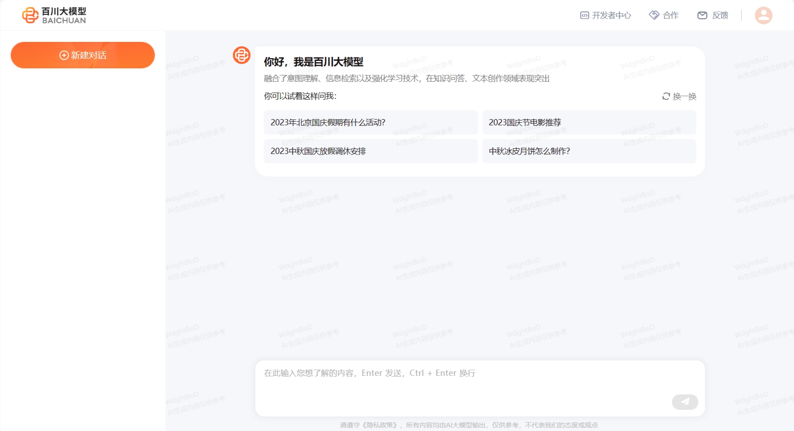

# 大语言模型食用指南

## 1 大语言模型发展背景

### 1.1 大语言模型发展历程

#### 1.1.1 什么是大语言模型

大语言模型（LLM）通俗一点讲，就是参数量非常大同时有复杂计算结构的自然语言处理模型。其“大”在，模型参数量大，数据集大，训练和使用资源大。按照领域分，可以用在自然语言处理，机器视觉处理，语音识别等方向。其代表作有GPT系列，Llama系列，千问系列等。

#### 1.1.2 大语言模型为什么主要是

作为通向AGI（通用人工智能）的必经之路，大模型选择了人类社会中使用最广泛的数据载体——文本作为训练时的数据，并采用主要采用文本作为输入输出的方式，或者结合文本与其他输入文件结合作为输入。业界很早就发现了用户对于对话交互的特殊偏好，陆奇在微软期间，就于 2016 年推进过“对话即平台（conversation as a platform）” 的战略。此外，苹果 Siri 、亚马逊 Echo 等基于语音对话的产品也非常受欢迎，反映出互联网用户对于聊天和对话这种交互模式的偏好。虽然之前的聊天机器人存在各种问题，但大型语言模型的出现再次让聊天机器人这种交互模式可以重新涌现。

#### 1.1.3 大语言模型特点与能力

* 1 大：大语言模型往往包含数十亿参数，完全训练需要数TB至数PB数据，训练需要大量的计算资源（完全训一个大预言模型需要数百个GPU）；
* 2 涌现能力：在小模型中不明显，但是在大模型中特别突出。简单来讲，就是模型性能随着规模增加而迅速提升，以一种类似指数的提升进行发展；
* 3 更好的泛化能力：能够基于一个或者多个大语言模型，构建复杂的任务，同时满足不同的需要，且保持相对良好的表现；
* 4 通过文本进行交互：大语言模型往往通过文本作为交互的内容，输入输出均为可直观被人理解的文字；
* 5 预训练与微调能力：通过输入自己的数据集，能够让大模型进行微调，生成更有针对性的内容；

### 1.2 大模型主流大模型发展现状

大语言模型的发展历程虽然只有短短五六年的时间，但是发展速度相当惊人，截止 2023 年 6 月，国内外有超过百种大模型相继发布。下图按照时间线给出了 2019 年至 2023 年 6 月比较有影响力并且模型参数量超过 100 亿的大语言模型：

接下来我们主要介绍几个国内外常见的大模型（包括开源和闭源）

#### 1.2.1 闭源大语言模型

##### 1.2.1.1 GPT 系列

> [OpenAI 模型介绍](https://platform.openai.com/docs/models)

**OpenAI** 公司在 `2018 年`提出的 **GPT（Generative Pre-Training）** 模型是典型的 `生成式预训练语言模型` 之一。

GPT 模型的基本原则是**通过语言建模将世界知识压缩到仅解码器 (decoder-only) 的 Transformer 模型中**，这样它就可以恢复(或记忆)世界知识的语义，并充当通用任务求解器。它能够成功的两个关键点：

- 训练能够准确预测下一个单词的 decoder-only 的 Transformer 语言模型
- 扩展语言模型的大小

OpenAI 在 LLM 上的研究大致可以分为以下几个阶段：

接下来，我们将从模型规模、特点等方面，介绍大家熟知的 ChatGPT 与 GPT4：

###### 1.2.1.1.1 ChatGPT

> [ChatGPT 使用地址](https://chat.openai.com)

`2022 年 11 月`，**OpenAI** 发布了基于 GPT 模型（GPT-3.5 和 GPT-4） 的**会话应用 ChatGPT**。由于与人类交流的出色能力，ChatGPT 自发布以来就引发了人工智能社区的兴奋。ChatGPT 是基于强大的 GPT 模型开发的，具有特别优化的会话能力。

ChatGPT 从本质上来说是一个 LLM 应用，是基于基座模型开发出来的，与基座模型有本质的区别。其支持 GPT-3.5 和 GPT-4 两个版本。

现在的 ChatGPT 支持最长达 32,000 个字符，知识截止日期是 2021 年 9 月，它可以执行各种任务，包括**代码编写、数学问题求解、写作建议**等。ChatGPT 在与人类交流方面表现出了卓越的能力：拥有丰富的知识储备，对数学问题进行推理的技能，在多回合对话中准确追踪上下文，并且与人类安全使用的价值观非常一致。后来，ChatGPT 支持插件机制，这进一步扩展了 ChatGPT 与现有工具或应用程序的能力。到目前为止，它似乎是人工智能历史上最强大的聊天机器人。ChatGPT 的推出对未来的人工智能研究具有重大影响，它为探索类人人工智能系统提供了启示。

###### 1.2.1.1.2 GPT-4

`2023 年 3 月`发布的 GPT-4，它将**文本输入扩展到多模态信号**。GPT3.5 拥有 1750 亿 个参数，而 GPT4 的参数量官方并没有公布，但有相关人员猜测，GPT-4 在 120 层中总共包含了 1.8 万亿参数，也就是说，GPT-4 的规模是 GPT-3 的 10 倍以上。因此，GPT-4 比 GPT-3.5 **解决复杂任务的能力更强，在许多评估任务上表现出较大的性能提升**。

最近的一项研究通过对人为生成的问题进行定性测试来研究 GPT-4 的能力，这些问题包含了各种各样的困难任务，并表明 GPT-4 可以比之前的 GPT 模型(如 GPT3.5 )实现更优越的性能。此外，由于六个月的迭代校准(在 RLHF 训练中有额外的安全奖励信号)，GPT-4 对恶意或挑衅性查询的响应更安全，并应用了一些干预策略来缓解 LLM 可能出现的问题，如幻觉、隐私和过度依赖。

> 注意：2023 年 11 月 7 日， OpenAI 召开了首个开发者大会，会上推出了最新的大语言模型 GPT-4 Turbo，Turbo 相当于进阶版。它将上下文长度扩展到 128k，相当于 300 页文本，并且训练知识更新到 2023 年 4 月

GPT3.5 是免费的，而 GPT-4 是收费的。需要开通 plus 会员 20 美元/月。

`2024 年 5 月 14 日`，新一代旗舰生成模型 **GPT-4o** 正式发布。GPT-4o 具备了对文本、语音、图像三种模态的深度理解能力，反应迅速且富有情感色彩，极具人性化。而且 GPT-4o 是完全免费的，虽然每天的免费使用次数是有限的。

通常我们可以调用模型 API 来开发自己的应用，主流模型 [API 对比](https://openai.com/pricing)如下：

|      语言模型名称      | 上下文长度 |        特点        | input 费用($/million tokens) | output 费用($/ 1M tokens) | 知识截止日期 |              |
| :--------------------: | :--------: | :----------------: | :--------------------------------------------------------: | :----------: | :-----------: |
|   GPT-3.5-turbo-0125   |    16k    |   经济，专门对话   |                            0.5                            |     1.5     | 2021 年 9 月 |
| GPT-3.5-turbo-instruct |     4k     |      指令模型      |                            1.5                            |      2      | 2021 年 9 月 |
|         GPT-4         |     8k     |      性能更强      |                             30                             |      60      | 2021 年 9 月 |
|       GPT-4-32k       |    32k    |  性能强，长上下文  |                             60                             |     120     | 2021 年 9 月 |
|      GPT-4-turbo      |    128k    |      性能更强      |                             10                             |      30      | 2023 年 12 月 |
|         GPT-4o         |    128k    | 性能最强，速度更快 |                             5                             |      15      | 2023 年 10 月 |

|   Embedding 模型名称   |     维度     | 特点 | 费用($/ 1M tokens) |
| :--------------------: | :-----------: | :--: | :----------------: |
| text-embedding-3-small |   512/1536   | 较小 |        0.02        |
| text-embedding-3-large | 256/1024/3072 | 较大 |        0.13        |
|         ada v2         |     1536     | 传统 |        0.1        |

##### 1.2.1.2 Claude 系列

Claude 系列模型是由 OpenAI 离职人员创建的 **Anthropic** 公司开发的闭源语言大模型。

> [Claude 使用地址](https://claude.ai/chats)

最早的 **Claude** 于 `2023 年 3 月 15 日`发布，在 2023 年 7 月 11 日，更新至 **Claude-2**， 并在 `2024 年 3 月 4 日`更新至 **Claude-3**。

Claude 3 系列包括三个不同的模型，分别是 Claude 3 Haiku、Claude 3 Sonnet 和 Claude 3 Opus，它们的能力依次递增，旨在满足不同用户和应用场景的需求。

|    模型名称    | 上下文长度 |   特点   | input 费用($/1M tokens) | output 费用($/1M tokens) |      |
| :-------------: | :--------: | :------: | :--------------------------------------------------: | :--: |
| Claude 3 Haiku |    200k    | 速度最快 |                         0.25                         | 1.25 |
| Claude 3 Sonnet |    200k    |   平衡   |                          3                          |  15  |
|  Claude 3 Opus  |    200k    | 性能最强 |                          15                          |  75  |

##### 1.2.1.1.3 PaLM/Gemini 系列

**PaLM 系列**语言大模型由 **Google** 开发。其初始版本于 `2022 年 4 月`发布，并在 2023 年 3 月公开了 API。2023 年 5 月，Google 发布了 **PaLM 2**，`2024 年 2 月 1 日`，Google 将 Bard(之前发布的对话应用) 的底层大模型驱动由 PaLM2 更改为 **Gemini**，同时也将原先的 Bard 更名为 **Gemini**。

> [PaLM 官方地址](https://ai.google/discover/palm2/)

> [Gemini 使用地址](https://gemini.google.com/)

目前的 Gemini 是第一个版本，即 Gemini 1.0，根据参数量不同分为 Ultra, Pro 和 Nano 三个版本。

以下窗口是 Gemini 的界面:

##### 1.2.1.1.4 文心一言

> [文心一言使用地址](https://yiyan.baidu.com)

**文心一言是基于百度文心大模型的知识增强语言大模型**，于 `2023 年 3 月`在国内率先开启邀测。文心一言的基础模型文心大模型于 2019 年发布 1.0 版，现已更新到 **4.0** 版本。更进一步划分，文心大模型包括 NLP 大模型、CV 大模型、跨模态大模型、生物计算大模型、行业大模型。中文能力相对来说非常不错的闭源模型。

文心一言网页版分为**免费版**和**专业版**。

- 免费版使用文心 3.5 版本，已经能够满足个人用户或小型企业的大部分需求。
- 专业版使用文心 4.0 版本。定价为 59.9 元/月，连续包月优惠价为 49.9 元/月

同时也可以使用 API 进行调用（[计费详情](https://console.bce.baidu.com/qianfan/chargemanage/list)）。

以下是文心一言的使用界面：

##### 1.2.1.1.5 星火大模型

> [星火大模型使用地址](https://xinghuo.xfyun.cn)

**讯飞星火认知大模型**是**科大讯飞**发布的语言大模型，支持多种自然语言处理任务。该模型于 `2023 年 5 月`首次发布，后续经过多次升级。`2023 年 10 月`，讯飞发布了**讯飞星火认知大模型 V3.0**。`2024 年 1 月`，讯飞发布了**讯飞星火认知大模型 V3.5**，在语言理解，文本生成，知识问答等七个方面进行了升级，并且支持 system 指令，插件调用等多项功能。

以下是讯飞星火的使用界面：

#### 1.2.2. 开源 LLM

##### 1.2.2.1 LLaMA 系列

> [LLaMA 官方地址](https://llama.meta.com)

> [LLaMA 开源地址](https://github.com/facebookresearch/llama)

**LLaMA 系列模型**是 **Meta** 开源的一组参数规模 **从 7B 到 70B** 的基础语言模型。LLaMA 于 `2023 年 2 月`发布，2023 年 7 月发布了 LLaMA2 模型，并于 `2024 年 4 月 18 日`发布了 **LLaMA3** 模型。它们都是在数万亿个字符上训练的，展示了如何**仅使用公开可用的数据集来训练最先进的模型**，而不需要依赖专有或不可访问的数据集。这些数据集包括 Common Crawl、Wikipedia、OpenWebText2、RealNews、Books 等。LLaMA 模型使用了**大规模的数据过滤和清洗技术**，以提高数据质量和多样性，减少噪声和偏见。LLaMA 模型还使用了高效的**数据并行**和**流水线并行**技术，以加速模型的训练和扩展。特别地，LLaMA 13B 在 CommonsenseQA 等 9 个基准测试中超过了 GPT-3 (175B)，而 **LLaMA 65B 与最优秀的模型 Chinchilla-70B 和 PaLM-540B 相媲美**。LLaMA 通过使用更少的字符来达到最佳性能，从而在各种推理预算下具有优势。

与 GPT 系列相同，LLaMA 模型也采用了 **decoder-only** 架构，同时结合了一些前人工作的改进：

- `Pre-normalization 正则化`：为了提高训练稳定性，LLaMA 对每个 Transformer 子层的输入进行了 RMSNorm 归一化，这种归一化方法可以避免梯度爆炸和消失的问题，提高模型的收敛速度和性能；
- `SwiGLU 激活函数`：将 ReLU 非线性替换为 SwiGLU 激活函数，增加网络的表达能力和非线性，同时减少参数量和计算量；
- `旋转位置编码（RoPE，Rotary Position Embedding）`：模型的输入不再使用位置编码，而是在网络的每一层添加了位置编码，RoPE 位置编码可以有效地捕捉输入序列中的相对位置信息，并且具有更好的泛化能力。

**LLaMA3** 在 LLaMA 系列模型的基础上进行了改进，提高了模型的性能和效率：

- `更多的训练数据量`：LLaMA3 在 15 万亿个 token 的数据上进行预训练，相比 LLaMA2 的训练数据量增加了 7 倍，且代码数据增加了 4 倍。LLaMA3 能够接触到更多的文本信息，从而提高了其理解和生成文本的能力。
- `更长的上下文长度`：LLaMA3 的上下文长度增加了一倍，从 LLaMA2 的 4096 个 token 增加到了 8192。这使得 LLaMA3 能够处理更长的文本序列，改善了对长文本的理解和生成能力。
- `分组查询注意力（GQA，Grouped-Query Attention）`：通过将查询（query）分组并在组内共享键（key）和值（value），减少了计算量，同时保持了模型性能，提高了大型模型的推理效率（LLaMA2 只有 70B 采用）。
- `更大的词表`：LLaMA3 升级为了 128K 的 tokenizer，是前两代 32K 的 4 倍，这使得其语义编码能力得到了极大的增强，从而显著提升了模型的性能。

##### 1.2.2.2 通义千问

> [通义千问使用地址](https://tongyi.aliyun.com)

> [通义千问开源地址](https://github.com/QwenLM/Qwen2)

**通义千问由阿里巴巴基于“通义”大模型研发**，于 `2023 年 4 月`正式发布。2023 年 9 月，阿里云开源了 Qwen（通义千问）系列工作。2024 年 2 月 5 日，开源了 **Qwen1.5**（Qwen2 的测试版）。并于 `2024 年 6 月 6 日`正式开源了 **Qwen2**。 Qwen2 是一个 **decoder-Only** 的模型，采用 `SwiGLU 激活`、`RoPE`、`GQA`的架构。中文能力相对来说非常不错的开源模型。

目前，已经开源了 5 种模型大小：**0.5B、1.5B、7B、72B 的 Dense 模型和 57B (A14B)的 MoE 模型**；所有模型均支持长度为 **32768 token** 的上下文。并将 Qwen2-7B-Instruct 和 Qwen2-72B-Instruct 的上下文长度扩展至 **128K token**。

以下是通义千问的使用界面：

##### 1.2.2.3 GLM 系列

> [ChatGLM 使用地址](https://chatglm.cn/)

> [ChatGLM 开源地址](https://github.com/THUDM/GLM-4)

**GLM 系列模型**是**清华大学和智谱 AI 等**合作研发的语言大模型。2023 年 3 月 发布了 **ChatGLM**。6 月发布了 **ChatGLM 2**。10 月推出了 **ChatGLM3**。2024 年 1 月 16 日 发布了 **GLM4**，并于 `2024 年 6 月 6 日`正式开源。

**GLM-4-9B-Chat** 支持多轮对话的同时，还具备网页浏览、代码执行、自定义工具调用（Function Call）和长文本推理（支持最大 **128K** 上下文）等功能。

开源了 `对话模型` **GLM-4-9B-Chat**、`基础模型` **GLM-4-9B**、`长文本对话模型` **GLM-4-9B-Chat-1M**（支持 1M 上下文长度）、`多模态模型`**GLM-4V-9B** 等全面对标 OpenAI。

以下是智谱清言的使用界面：
``

##### 1.2.2.4 Baichuan 系列

> [百川使用地址](https://www.baichuan-ai.com/chat)

> [百川开源地址](https://github.com/baichuan-inc)

**Baichuan** 是由**百川智能**开发的**开源可商用**的语言大模型。其基于**Transformer 解码器架构（decoder-only）**。

2023 年 6 月 15 日发布了 **Baichuan-7B** 和 **Baichuan-13B**。百川同时开源了**预训练**和**对齐**模型，`预训练模型是面向开发者的“基座”`，而 `对齐模型则面向广大需要对话功能的普通用户`。

**Baichuan2** 于 `2023年 9 月 6 日`推出。发布了 **7B、13B** 的 **Base** 和 **Chat** 版本，并提供了 Chat 版本的 **4bits 量化**。

`2024 年 1 月 29 日` 发布了 **Baichuan 3**。但是**目前还没有开源**。

以下是百川大模型的使用界面：

### 1.3 大语言模型的应用与影响

LLM 已经在许多领域产生了深远的影响。在**自然语言处理**领域，它可以帮助计算机更好地理解和生成文本，包括写文章、回答问题、翻译语言等。在**信息检索**领域，它可以改进搜索引擎，让我们更轻松地找到所需的信息。在**计算机视觉**领域，研究人员还在努力让计算机理解图像和文字，以改善多媒体交互。

最重要的是，LLM 的出现让人们重新思考了 **通用人工智能（AGI）** 的可能性。AGI 是一种像人类一样思考和学习的人工智能。LLM 被认为是 AGI 的一种早期形式，这引发了对未来人工智能发展的许多思考和计划。

总之，LLM 是一种令人兴奋的技术，它让计算机更好地理解和使用语言，正在改变着我们与技术互动的方式，同时也引发了对未来人工智能的无限探索。

## 2 大模型技术路线

### 2.1 什么是Transformer

大语言模型的成功基于起源于一个基础模块：Transformer。

Transformer是一种用于自然语言处理（NLP）和其他序列到序列（sequence-to-sequence）任务的深度学习模型架构，它在2017年由Vaswani等人首次提出。Transformer架构引入了自注意力机制（self-attention mechanism），这是一个关键的创新，使其在处理序列数据时表现出色。

Transformer结构：

self-attention结构：

Transformer结构中，较为重要的两个部分为：encoder和decoder。encoder负责将输入序列编码为固定长度的向量，而decoder则根据编码后的向量生成输出序列。

### 2.1 encoder only

**使用encoder-only的模型主要的思路是通过编码器，将大量文本、时序数据等资料进行编码、压缩，达到进一步抽象理解输入数据的能力。**

**encoder-only模型，特点侧重于：**

**理解**和**分类**输入信息，比如判断一段文本的感情倾向，或者文本主题分类。这种架构主要用于处理输入数据，专注于**理解**和编码信息，而不是生成新的文本。Encoder-Only模型在**理解**和**分类**任务中更为有效，例如文本分类、情感分析等

### 2.2 decoder noly

**使用decoder-only的模型主要是通过解码器，对已输入的信息进行解码衍生。**

**decoder-only模型，特点侧重于：**

**擅长创造性的写作，比如写小说或自动生成文章。它更多关注于从已有的信息（开头）扩展出新的内容。**

**OpenAI 选择了Decoder-Only方案（如GPT系列），因为它对于自然语言生成**特别有效。这种架构能够更好地**理解**和**预测**语言模式，尤其适合处理开放式的、生成性的任务。

### 2.3 encoder-decoder

**基于encoder-decoder结构的模型，同时能够编码和解码对应的输入信息。**

**encoder-decoder结构的模型，特点侧重于：**

**擅长处理需要理解输入然后生成相关输出的任务，比如翻译**或**问答**系统。

**这种模型在需要深入理解输入内容并生成相关响应的任务中表现良好，例如机器翻译、问答系统等。**

# 为什么现在decoder-only为主流

1. **decoder-only和encoder-decoder结构相比，有什么优势？**
   **相比较而言，decoder-only需要的计算资源更少，能够更快学习和训练得到最终的模型。**
2. **decoder-only和encoder-only结构相比，有什么优势？**
   **encoder-only更加侧重于对信息的压缩与分类，在对输入内容进行扩展的情况下效果不佳。**

## 3、大模型部署与加速指南

## 4、 大模型开发应用手册

## 5、大模型微调数据集

## 6、大模型智能体（Agent）
